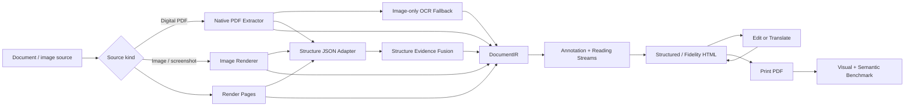

<p align="center">
  
</p>

<h1 align="center">Scriptorium</h1>

<p align="center">
  <strong>Convert document sources into editable, annotated, benchmarkable HTML with enough structure evidence for translation and re-rendering.</strong>
</p>

<p align="center">
  <a href="README.md"></a>
  <a href="README.en.md"></a>
</p>

<p align="center">
  
  
  
  
</p>

<p align="center">
  <a href="#quick-start">Quick Start</a>
  ·
  <a href="#core-workflow">Workflow</a>
  ·
  <a href="#benchmark">Benchmark</a>
  ·
  <a href="https://followcat.github.io/Scriptorium/">Live Gallery</a>
  ·
  <a href="#documentation">Docs</a>
</p>

Scriptorium is a source-neutral document-to-HTML conversion and evaluation engine. The current main path covers PNG/JPEG/TIFF/WebP images, screenshots, PDFs, web-printed PDFs, and image-only PDFs; image sources enter the IR as first-class sources instead of pretending to be PDFs first.

It merges source text, images, vector drawings, OCR output, and external structure JSON into a single `DocumentIR`, then exports coordinate-aware HTML. Each editable node keeps its source, bbox, style, role, reading stream, and edit/translation fields, so downstream tools can write `edited_text` or `translated_text` and print the result back to PDF.

## When to Use It

| Use case | What Scriptorium provides |
|---|---|
| Document editing experiments | Local text nodes that can be addressed, replaced, and written back through HTML/IR. |
| Document translation re-rendering | Source-preserving visual layers, `translated_text` replacements, browser-measured fitting, and mask/overflow/conflict diagnostics. |
| Papers, annual reports, and portal pages | Multi-column body flow, table islands, card grids, footnotes, sidebars, page artifacts, and local reading streams. |
| OCR/layout-model validation | PaddleOCR-VL, PP-Structure, Docling, OpenDataLoader, and ROOR-style JSON fusion where OCR/structure JSON can drive image-source semantics, plus native-only vs native-plus-structure A/B benchmarks. |
| Conversion quality regression | Print HTML back to PDF and measure visual similarity, page/size match, semantic order, and risk metrics. |

## Why Not Just Screenshots

Many PDF-to-HTML / OCR-to-HTML tools render a whole page image and overlay a hidden text layer. That can look close, but it leaves little structure for local editing, translation, or reading-order analysis.

Scriptorium supports two output paths:

- `structured`: rebuild text, images, and shapes with HTML/SVG where possible, making structure and editability easy to inspect.
- `fidelity`: preserve an SVG/raster source visual layer while keeping recognized text and structure nodes as transparent coordinate anchors; edited or translated nodes print as browser-fitted local replacement overlays.

HTML nodes carry `data-scriptorium-*` metadata such as role, source, bbox, style id, reading order, reading stream, translation target, and replacement risk. See [Implementation notes](docs/implementation-notes.md) for the full model.

For detected table and card-grid islands, strict native local successor evidence is reported separately from page-wide candidate consensus. A diagnostic-only protected path-cover candidate preserves valid strict island edges as constraints and reports rejected or unresolved edges separately. This keeps translation streams stable without pretending that unresolved body or cross-region handoffs are solved.

Standalone HTML also exposes `window.ScriptoriumEdits`: browser changes become validated `scriptorium-html-edits/v1` patches that `scriptorium apply-html-edits` can write back to the same `DocumentIR` before another export or print.

<table>
  <tr>
    <td width="50%">
      <br>
      <strong>Web and portal sources</strong><br>
      Print PDFs or capture screenshots with Playwright, then convert them into HTML with native/OCR coordinate anchors.
    </td>
    <td width="50%">
      <br>
      <strong>Papers, reports, and manuals</strong><br>
      Track visual fidelity, semantic order, candidate disagreement, and translation replacement risk across source types.
    </td>
  </tr>
</table>

<p align="center">
  <a href="https://followcat.github.io/Scriptorium/"><strong>Open the interactive source-to-HTML gallery</strong></a>
  ·
  <a href="docs/showcase/README.md">View on GitHub</a>
</p>

## Quick Start

```bash
python3 -m venv .venv
. .venv/bin/activate
pip install -r requirements.txt
pip install -e .
```

Images, screenshots, and scanned pages can be converted directly. When OCR/structure JSON is available, it seeds text anchors first, then structure evidence adds roles, reading order, and reading streams:

```bash
scriptorium convert \
  path/to/page.png \
  --input-kind image \
  --ocr-json path/to/page.ocr.json \
  --structure-json path/to/page.structure.json \
  --out-dir outputs/image-source

scriptorium export-html \
  outputs/image-source/document.ir.json \
  --out-dir outputs/image-source/html \
  --display-mode fidelity
```

Saved PaddleOCR-VL JSON retains the model input canvas. Scriptorium maps its
pixel boxes through that saved `width`/`height`, so one model run can be
replayed safely at a different conversion or benchmark DPI.

For reproducible PP-StructureV3 layout evidence, install the optional OCR
runtime, persist a model run, then pass that JSON back through the ordinary
structure A/B path:

```bash
pip install -r requirements-ocr.txt

scriptorium run-pp-structure path/to/paper.pdf \
  --max-pages 1 --dpi 144 --device cpu \
  --output outputs/paper.pp-structure.json

scriptorium benchmark-structure-ab path/to/paper.pdf \
  --max-pages 1 --dpi 144 \
  --structure-json outputs/paper.pp-structure.json \
  --out-dir outputs/paper-structure-ab
```

The default runner is layout-focused. Add `--table-recognition` or
`--formula-recognition` when the saved evidence needs table cells or formulas.
The JSON is evidence, not an automatic replacement for native PDF text or a
claim that a whole-page reading order is unambiguous.

For digital PDFs, the Apache-2.0 OpenDataLoader XY-Cut++ CPU provider is another
option. It requires Java 11+ and always emits review-only evidence without
changing runtime order:

```bash
pip install -r requirements-opendataloader.txt

scriptorium run-opendataloader path/to/paper.pdf \
  --page-ranges 1-3 \
  --output outputs/paper.opendataloader.json
```

Docling Heron can also provide layout candidates for PDFs or images. Its
normalized JSON is review-only and isolated from runtime order and successor
consensus:

```bash
pip install -r requirements-docling.txt

scriptorium run-docling path/to/page.png \
  --output outputs/page.docling.json
```

Use the normalized `--output` for structure A/B runs; `--raw-output` is only
for inspecting Docling's original result. Current held-out evidence does not
support promoting Docling reading order to the default orderer.

For actual successor-relation research, a lightweight ranker with calibrated
branching can be trained locally from the official ROOR train split. It accepts
answer-free structure JSON or a multi-page `DocumentIR`, and output remains review-only:

```bash
pip install -r requirements-relation-ranker.txt
scriptorium train-relation-ranker path/to/ROOR-Datasets/data \
  -o outputs/models/relation-ranker.joblib
scriptorium run-relation-ranker page.structure.json \
  --model outputs/models/relation-ranker.joblib \
  -o outputs/page.relations.json
```

Only load locally generated joblib models. The adjacent manifest verifies its
SHA-256 digest and records the training split and calibration metrics.
Explicit figure/table roles are also retained: local caption geometry adds
review-only `figure -> caption` or `caption -> table` evidence without changing
runtime order. Multi-line captions use answer-free layout block membership, and
this evidence is labelled separately from learned text edges. When several
figures/tables and captions coexist, a global one-to-one assignment maximizes
valid pair count and then total geometry score, so input-list order cannot let
an early graphical block claim a shared caption. Caption locality does not
require horizontal bbox overlap: train-only calibration uses a `0.35` page-width
center-distance gate and a `0.12` page-height vertical gap, accepting legitimate
offset/left-aligned captions while rejecting remote-column candidates.

An independent cross-domain relation benchmark can be generated from a fixed
Comp-HRDoc test document. Official order labels and answer-free layout anchors
are written separately:

```bash
scriptorium fetch-comphrdoc --max-pages 5 \
  --out-dir data/external/comphrdoc-test
```

For larger relation-only experiments, build a fixed cross-document floating
prefix without downloading or redistributing page images, then run a reproducible A/B:

```bash
scriptorium fetch-comphrdoc-relations --sample-count 250 \
  --out-dir data/external/comphrdoc-relations
scriptorium train-floating-ranker /path/to/CompHRDoc.zip \
  --output outputs/models/floating-ranker.joblib
scriptorium benchmark-comphrdoc-relations data/external/comphrdoc-relations \
  --model outputs/models/relation-ranker.joblib \
  --floating-model outputs/models/floating-ranker.joblib
```

The trained provider runs global one-to-one assignment at every candidate
threshold and calibrates margin from source- and target-side competitors. It
also trains a 12-feature linear correctness forecaster from four-fold cross-fit
clean/mild/stress views of official train documents; a noise-aware gate must
also pass the original confidence/margin gate. Fixed 250-page strict precision
is `0.98461538` clean, `0.97604790` mild, and `0.93965517` stress. Stress remains
below `0.97`, so output stays review evidence rather than an automatic runtime
constraint. Reports score noise-aware graphical subsets, joint body/floating
path cover, degree/cycle conflicts, and answer-free label-audit conflicts.
Use `--noise-profile mild` or `stress` for deterministic synthetic robustness
checks; these profiles do not replace benchmarks from real OCR providers.

Match saved PaddleOCR-VL or Docling output to rendered oracle anchors with:

```bash
scriptorium benchmark-provider-anchor-suite data/external/comphrdoc-rendered \
  outputs/provider-structure --floating-model outputs/models/floating-ranker.joblib
```

Provider paragraphs still accept many oracle lines per block; figure/table
anchors use global one-to-one assignment. Reports preserve raw official-relation
scores and add `graphical_relation_audit`, comparing official graphical labels
with an answer-free local-geometry proposal. This audit detects label/association
conflicts; it is not replacement ground truth and cannot change runtime order.
The same report adds `provider_degradation`, separating missing, hallucination,
size, split, merge, overlap, duplicate, and type-confusion errors from bbox and
OCR/caption-text fidelity. Small OCR anchors nested inside figures or tables are
reported as nested content instead of being mislabeled as hallucinations; the
clean/mild/stress distance is descriptive and never acts as a runtime gate.

Install the optional Surya FastLayout provider in a dedicated environment. The
command requires explicit acceptance of the model-weight license; learned order,
labels, and successor relations remain review-only and cannot change runtime roles,
reading streams, or order:

```bash
python3 -m venv .venv-surya
. .venv-surya/bin/activate
pip install -r requirements-surya.txt
pip install -e .

scriptorium run-surya-layout path/to/paper.pdf \
  --page-ranges 1-3 --device cpu \
  --accept-model-license \
  --output outputs/paper.surya-layout.json
```

The command fails closed when the learned-order head, detector feature map, or a
valid permutation is unavailable, or when a page exceeds the model's box capacity.
It never records raster fallback order as learned evidence.

When a model supplies explicit `block_order` for a body/paragraph block and
all matched native lines stay in one selected flow segment and column,
Scriptorium promotes them to an `external-block-body-*` local translation
stream. This does not reorder the page or bridge tables, grids, captions,
page artifacts, footnotes, or sidebars; it is a paragraph-level batching
boundary for translation and editing, not a whole-page reading-order claim.

The built-in PDF fixture is still useful for a fully runnable smoke test:

```bash
scriptorium make-fixture --out-dir data/fixture

scriptorium convert \
  data/fixture/sample.pdf \
  --ocr-json data/fixture/sample.ocr.json \
  --out-dir outputs/sample

scriptorium export-html \
  outputs/sample/document.ir.json \
  --out-dir outputs/sample/html \
  --display-mode structured
```

Print the HTML back to PDF and compare:

```bash
scriptorium print-pdf \
  outputs/sample/html/index.html \
  --pdf outputs/sample/export.pdf

scriptorium compare-pdf \
  data/fixture/sample.pdf \
  outputs/sample/export.pdf \
  --out-dir outputs/sample/pdf-quality
```

External OCR/layout models are optional. Without OCR or structure JSON, an image source still keeps the full-page visual layer; with OCR or Paddle/PP-Structure/Docling/ROOR-style structure JSON it gains transparent text anchors and reading-stream evidence. OpenDataLoader itself is PDF-only and does not change the first-class image-source path.

Optional OCR dependencies live in `requirements-ocr.txt`. Image-only OCR fallback also requires the system `tesseract` binary and language data; local PP-StructureV3 runs need the version-specific Paddle CPU compatibility settings in the [implementation notes](docs/implementation-notes.md#external-structure-evidence-fusion).

## Core Workflow



Main modules:

| Module | Role |
|---|---|
| `native_pdf.py` | Extract native text, images, drawings, and page geometry. |
| `structure_evidence.py` | Normalize PaddleOCR-VL / PP-Structure / Docling / ROOR-style structure evidence. |
| `opendataloader_provider.py` | Run OpenDataLoader XY-Cut++ and emit review-only block/relation JSON. |
| `ocr.py` | Normalize OCR/structure JSON into image/source text anchors and record the semantic-layer source; for image sources, structure JSON can be the semantic driver. |
| `reading_order.py` | Build multi-column flow, table islands, card grids, footnotes, sidebars, captions, and reading streams. |
| `provider_degradation.py` | Decompose real OCR/layout-provider geometry, granularity, type, and text degradation. |
| `html_export.py` | Export structured/fidelity HTML with edit and translation anchors. |
| `benchmark.py` | Run visual, semantic-order, structure A/B, and translation re-rendering benchmarks. |

## Benchmark

Run the built-in benchmark:

```bash
scriptorium benchmark --out-dir outputs/benchmark-baseline --dpi 192
```

Run external documents with automatic fidelity path selection:

```bash
scriptorium benchmark path/to/file.pdf \
  --out-dir outputs/my-benchmark \
  --dpi 144 \
  --html-mode auto \
  --fidelity-background auto
```

Compare native-only against native-plus-structure:

```bash
scriptorium benchmark-structure-ab \
  path/to/source.pdf \
  --structure-json path/to/source.structure.json \
  --out-dir outputs/structure-ab \
  --dpi 144
```

Stress translated re-rendering:

```bash
scriptorium benchmark path/to/file.pdf \
  --html-mode fidelity \
  --fidelity-background auto \
  --translation-stress pseudo-expand \
  --out-dir outputs/translation-stress \
  --dpi 144
```

Image sources can be benchmarked directly. Visual scoring compares the source image visual layer against the rendered HTML-to-PDF output; structure JSON first seeds OCR/text anchors, then participates in reading-stream and structure-evidence fusion. Reports also expose `semantic_layer_driver`:

```bash
scriptorium benchmark path/to/page.png \
  --input-kind image \
  --image-dpi 96 \
  --structure-json path/to/page.structure.json \
  --html-mode structured \
  --out-dir outputs/image-benchmark
```

For relation-style reading-order validation, fetch a fixed prefix of the
official ROOR validation split. Generated `structure/*.structure.json` files
retain only image, text, and bbox anchors; official `ro_linkings` remain in an
adjacent evaluation sidecar and are never fused through `--structure-json`:

```bash
scriptorium fetch-roor \
  --split val \
  --sample-count 49 \
  --out-dir data/external/roor-validation-full-v1
```

When two or more independent providers use the same stable element IDs, intersect
their proposals to obtain a lower-noise review sidecar. The result remains a
`sidecar_status: proposal` payload and cannot trigger runtime reorder:

```bash
scriptorium consensus-reading-sidecars \
  outputs/native/reading-order.sidecar.proposal.json \
  outputs/pp/reading-order.sidecar.proposal.json \
  outputs/surya/reading-order.sidecar.proposal.json \
  --output outputs/reading-order.consensus.proposal.json
```

See [External benchmarks](docs/external-benchmarks.md#roor-relation-benchmark-v1) for the full command, relation metrics, and limits.

Representative current scores are shown below. Exact commands, sources, checksums, and full metrics are in [External benchmarks](docs/external-benchmarks.md).

| Sample | Pages | Main stress | Visual similarity | Notes |
|---|---:|---|---:|---|
| Hacker News print PDF | 2 | Real portal/list page | 0.9800288 | Has a semantic sidecar. |
| Attention Is All You Need | 15 | Paper columns, formulas, figures | 0.96840246 | Used for paper reading-order regression. |
| Transformer-XL | 11 | Two-column paper and page-size variance | 0.95679576 | Used for multi-column successor-edge checks. |
| BYD 2024 annual report | 40 | Chinese annual report, tables, dense vector rules | 0.89780001 | Current complex Chinese PDF stress sample. |
| JD homepage screenshot PDF | 1 | Image-only ecommerce homepage | 0.99576887 | OCR adds transparent editable anchors. |
| JD homepage screenshot PNG | 1 | First-class image source path | 0.99236799 | Matches the image-only PDF compatibility path's OCR/structure anchor inventory. |

`visual_similarity = 1 - max_diff_ratio`. Reports also include page/size match, diff distribution, reading-order risk, candidate disagreement, grid/table/stream statistics, and replacement risk.

## Editing and Translation

`source_text` always preserves the original recognized text. Local edits go to `edited_text`; translations go to `translated_text`. In fidelity mode, unchanged nodes stay hidden during print, while edited or translated nodes become local source-aware mask replacement layers.

Translation re-rendering currently focuses on three hard problems:

- Fitting longer translations back into the source bbox. Chromium measures the real glyph layout after fonts load, searches a bounded scale, and can compact line height before reporting actual clipping; the static estimate remains separately available for fallback and triage.
- Masking source text without damaging neighboring elements. Each mask side stops at adjacent visible boxes; light source text on a dark raster edge can use a sampled dark mask instead of the default white. Print conversion also maps source render pixels to 96-DPI CSS coordinates, so replacement boxes, padding, and font sizes retain their position in the exported PDF.
- Translating multi-column body flows, table islands, card grids, and sidebars as separate reading streams.

This is not a full end-user document editor yet. It is a measurable conversion core that exposes the right risks for a future UI, review workflow, or stronger model-based structure evidence.

## Current Boundaries

- Complex-page visual fidelity can be high with fidelity backgrounds; semantic order, local flow structure, and translated replacement conflicts are the harder parts.
- Without structure priors, portal pages, product grids, report tables, and OCR-heavy pages can have genuinely ambiguous reading order.
- PaddleOCR-VL / PP-Structure / Docling JSON can already be fused as evidence, but model runtimes remain optional.
- The project is a research prototype for conversion, evaluation, and architecture work, not a desktop document editor for end users.

## Documentation

- [简体中文 README](README.zh-CN.md)
- [默认中文 README](README.md)
- [Implementation notes](docs/implementation-notes.md)
- [Optimization roadmap](docs/optimization-roadmap.md)
- [External benchmarks](docs/external-benchmarks.md)
- [中文实现说明](docs/implementation-notes.zh-CN.md)
- [中文优化路线](docs/optimization-roadmap.zh-CN.md)
- [中文外部基准](docs/external-benchmarks.zh-CN.md)

## Development

```bash
pytest
```
