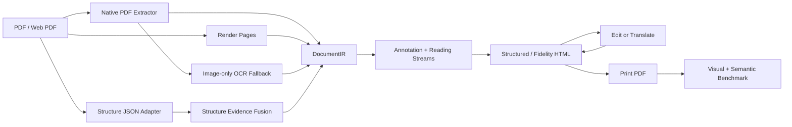

<p align="center">
  
</p>

<h1 align="center">Scriptorium PDF</h1>

<p align="center">
  <strong>Convert PDFs into editable, annotated, benchmarkable HTML with enough structure evidence for translation and re-rendering.</strong>
</p>

<p align="center">
  <a href="README.md"></a>
  <a href="README.en.md"></a>
</p>

<p align="center">
  
  
  
  
</p>

<p align="center">
  <a href="#quick-start">Quick Start</a>
  ·
  <a href="#core-workflow">Workflow</a>
  ·
  <a href="#benchmark">Benchmark</a>
  ·
  <a href="#documentation">Docs</a>
</p>

Scriptorium PDF is a PDF-to-HTML conversion and evaluation engine. It is built for PDFs that need to remain editable, translatable, structurally inspectable, or regression-tested, not for one-off screenshot-style conversions.

It merges native PDF text, images, vector drawings, OCR output, and external structure JSON into a single `DocumentIR`, then exports coordinate-aware HTML. Each editable node keeps its source, bbox, style, role, reading stream, and edit/translation fields, so downstream tools can write `edited_text` or `translated_text` and print the result back to PDF.

## When to Use It

| Use case | What Scriptorium PDF provides |
|---|---|
| PDF editing experiments | Local text nodes that can be addressed, replaced, and written back through HTML/IR. |
| Document translation re-rendering | Source-preserving visual layers, `translated_text` replacements, mask/fit/overflow/conflict diagnostics. |
| Papers, annual reports, and portal pages | Multi-column body flow, table islands, card grids, footnotes, sidebars, page artifacts, and local reading streams. |
| OCR/layout-model validation | PaddleOCR-VL, PP-Structure, and Docling-style JSON fusion with native-only vs native-plus-structure A/B benchmarks. |
| Conversion quality regression | Print HTML back to PDF and measure visual similarity, page/size match, semantic order, and risk metrics. |

## Why Not Just Screenshots

Many PDF-to-HTML tools render a whole page image and overlay a hidden text layer. That can look close, but it leaves little structure for local editing, translation, or reading-order analysis.

Scriptorium PDF supports two output paths:

- `structured`: rebuild text, images, and shapes with HTML/SVG where possible, making structure and editability easy to inspect.
- `fidelity`: preserve an SVG/raster source visual layer while keeping recognized text and structure nodes as transparent coordinate anchors; edited or translated nodes print as local replacement overlays.

HTML nodes carry `data-scriptorium-*` metadata such as role, source, bbox, style id, reading order, reading stream, translation target, and replacement risk. See [Implementation notes](docs/implementation-notes.md) for the full model.

<table>
  <tr>
    <td width="50%">
      <br>
      <strong>Web and portal PDFs</strong><br>
      Print or capture pages with Playwright, then convert them into HTML with native/OCR coordinate anchors.
    </td>
    <td width="50%">
      <br>
      <strong>Papers, reports, and manuals</strong><br>
      Track visual fidelity, semantic order, candidate disagreement, and translation replacement risk with repeatable benchmarks.
    </td>
  </tr>
</table>

## Quick Start

```bash
python3 -m venv .venv
. .venv/bin/activate
pip install -r requirements.txt
pip install -e .
```

Create a fixture PDF and export HTML:

```bash
scriptorium make-fixture --out-dir data/fixture

scriptorium convert \
  data/fixture/sample.pdf \
  --ocr-json data/fixture/sample.ocr.json \
  --out-dir outputs/sample

scriptorium export-html \
  outputs/sample/document.ir.json \
  --out-dir outputs/sample/html \
  --display-mode structured
```

Print the HTML back to PDF and compare:

```bash
scriptorium print-pdf \
  outputs/sample/html/index.html \
  --pdf outputs/sample/export.pdf

scriptorium compare-pdf \
  data/fixture/sample.pdf \
  outputs/sample/export.pdf \
  --out-dir outputs/sample/pdf-quality
```

External OCR/layout models are optional. If structure JSON already exists, it can be fused into the pipeline:

```bash
scriptorium convert \
  path/to/input.pdf \
  --structure-json path/to/structure.json \
  --out-dir outputs/with-structure
```

Optional OCR dependencies live in `requirements-ocr.txt`. Image-only OCR fallback also requires the system `tesseract` binary and language data.

## Core Workflow



Main modules:

| Module | Role |
|---|---|
| `native_pdf.py` | Extract native text, images, drawings, and page geometry. |
| `structure_evidence.py` | Normalize PaddleOCR-VL / PP-Structure / Docling-style structure evidence. |
| `reading_order.py` | Build multi-column flow, table islands, card grids, footnotes, sidebars, captions, and reading streams. |
| `html_export.py` | Export structured/fidelity HTML with edit and translation anchors. |
| `benchmark.py` | Run visual, semantic-order, structure A/B, and translation re-rendering benchmarks. |

## Benchmark

Run the built-in benchmark:

```bash
scriptorium benchmark --out-dir outputs/benchmark-baseline --dpi 192
```

Run external PDFs with automatic fidelity path selection:

```bash
scriptorium benchmark path/to/file.pdf \
  --out-dir outputs/my-benchmark \
  --dpi 144 \
  --html-mode auto \
  --fidelity-background auto
```

Compare native-only against native-plus-structure:

```bash
scriptorium benchmark-structure-ab \
  path/to/input.pdf \
  --structure-json path/to/input.structure.json \
  --out-dir outputs/structure-ab \
  --dpi 144
```

Stress translated re-rendering:

```bash
scriptorium benchmark path/to/file.pdf \
  --html-mode fidelity \
  --fidelity-background auto \
  --translation-stress pseudo-expand \
  --out-dir outputs/translation-stress \
  --dpi 144
```

Representative current scores are shown below. Exact commands, sources, checksums, and full metrics are in [External benchmarks](docs/external-benchmarks.md).

| Sample | Pages | Main stress | Visual similarity | Notes |
|---|---:|---|---:|---|
| Hacker News print PDF | 2 | Real portal/list page | 0.9800288 | Has a semantic sidecar. |
| Attention Is All You Need | 15 | Paper columns, formulas, figures | 0.96840246 | Used for paper reading-order regression. |
| Transformer-XL | 11 | Two-column paper and page-size variance | 0.95679576 | Used for multi-column successor-edge checks. |
| BYD 2024 annual report | 40 | Chinese annual report, tables, dense vector rules | 0.89780001 | Current complex Chinese PDF stress sample. |
| JD homepage screenshot PDF | 1 | Image-only ecommerce homepage | 0.99576887 | OCR adds transparent editable anchors. |

`visual_similarity = 1 - max_diff_ratio`. Reports also include page/size match, diff distribution, reading-order risk, candidate disagreement, grid/table/stream statistics, and replacement risk.

## Editing and Translation

`source_text` always preserves the original recognized text. Local edits go to `edited_text`; translations go to `translated_text`. In fidelity mode, unchanged nodes stay hidden during print, while edited or translated nodes become local white-mask replacement layers.

Translation re-rendering currently focuses on three hard problems:

- Fitting longer translations back into the source bbox, with scale-down and overflow reporting.
- Masking source text without damaging neighboring elements.
- Translating multi-column body flows, table islands, card grids, and sidebars as separate reading streams.

This is not a full end-user PDF editor yet. It is a measurable conversion core that exposes the right risks for a future UI, review workflow, or stronger model-based structure evidence.

## Current Boundaries

- Complex-page visual fidelity can be high with fidelity backgrounds; semantic order, local flow structure, and translated replacement conflicts are the harder parts.
- Without structure priors, portal pages, product grids, report tables, and OCR-heavy pages can have genuinely ambiguous reading order.
- PaddleOCR-VL / PP-Structure / Docling JSON can already be fused as evidence, but model runtimes remain optional.
- The project is a research prototype for conversion, evaluation, and architecture work, not a desktop PDF editor for end users.

## Documentation

- [简体中文 README](README.zh-CN.md)
- [默认中文 README](README.md)
- [Implementation notes](docs/implementation-notes.md)
- [Optimization roadmap](docs/optimization-roadmap.md)
- [External benchmarks](docs/external-benchmarks.md)
- [中文实现说明](docs/implementation-notes.zh-CN.md)
- [中文优化路线](docs/optimization-roadmap.zh-CN.md)
- [中文外部基准](docs/external-benchmarks.zh-CN.md)

## Development

```bash
pytest
```
