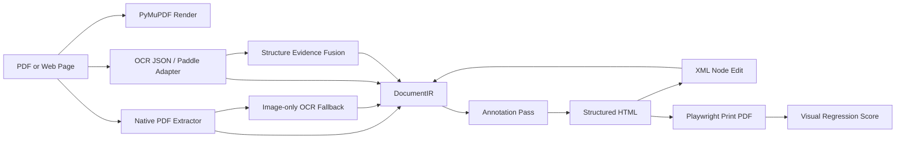

<p align="center">
  
</p>

<h1 align="center">Scriptorium PDF</h1>

<p align="center">
  <strong>Convert PDFs, web-print PDFs, and OCR structure output into editable, annotated, benchmarkable HTML.</strong>
</p>

<p align="center">
  <a href="README.md"></a>
  <a href="README.en.md"></a>
</p>

<p align="center">
  
  
  
  
  
  
</p>

<p align="center">
  <a href="#quick-start">Quick Start</a>
  ·
  <a href="#real-world-scores">Scores</a>
  ·
  <a href="#architecture">Architecture</a>
  ·
  <a href="#benchmark">Benchmark</a>
  ·
  <a href="docs/optimization-roadmap.md">Roadmap</a>
</p>

<p align="center">
  <strong>Scriptorium PDF is built for PDF editing, translation, layout reconstruction, OCR validation, and HTML-to-PDF quality research.</strong><br>
  It keeps source evidence intact, maps text/coordinates/styles/layout roles/reading order into one IR, and uses reproducible benchmarks to track whether each optimization actually improves output quality.
</p>

<table>
  <tr>
    <td width="34%" valign="top">
      <strong>Goal</strong><br>
      Convert PDFs, web-print PDFs, scanned/screenshot PDFs, and external OCR structure output into coordinate-aware HTML.
    </td>
    <td width="33%" valign="top">
      <strong>Not This</strong><br>
      Not a hand-written stylesheet for one sample, and not a full-page screenshot with a fragile hidden text layer.
    </td>
    <td width="33%" valign="top">
      <strong>Output</strong><br>
      Every node keeps bbox, role, style, source, reading order, edit fields, and translation fields for later PDF write-back.
    </td>
  </tr>
</table>

<table>
  <tr>
    <td width="50%" valign="top">
      <strong>Chinese documentation</strong><br>
      <a href="README.md">默认中文首页</a> ·
      <a href="README.zh-CN.md">中文镜像</a> ·
      <a href="docs/implementation-notes.zh-CN.md">实现说明</a> ·
      <a href="docs/optimization-roadmap.zh-CN.md">优化路线</a> ·
      <a href="docs/external-benchmarks.zh-CN.md">外部基准</a>
    </td>
    <td width="50%" valign="top">
      <strong>English documentation</strong><br>
      <a href="README.en.md">English README</a> ·
      <a href="docs/implementation-notes.md">Implementation notes</a> ·
      <a href="docs/optimization-roadmap.md">Optimization roadmap</a> ·
      <a href="docs/external-benchmarks.md">External benchmarks</a>
    </td>
  </tr>
</table>

| Capability | Current Status |
|---|---|
| Structured HTML | Text, images, shapes, layout groups, roles, bboxes, style ids, and source markers are exported to DOM metadata. |
| Editing and translation | `source_text` is preserved; edits go to `edited_text`, translations go to `translated_text`, with XML/IR round trips. |
| OCR and structure evidence | Supports image-only OCR fallback and PaddleOCR-VL / PP-Structure / Docling JSON fusion. |
| Visual fidelity | Supports structured redraw, SVG/raster fidelity overlay, and benchmark-time font/scale/text-fit selection. |
| Semantic reading order | Supports XY-Cut, multi-column flow, table islands, headers/footers, footnotes, sidebars, captions, reading streams, caption-target proximity, relation graph, structure-relation, successor-consensus diagnostics, and conservative runtime arbitration. |
| Quality metrics | Reports visual similarity, page diff distribution, semantic order, successor accuracy, candidate arbitration, and risk diagnostics. |

<table>
  <tr>
    <td width="50%">
      <br>
      <strong>Web and portal PDFs</strong><br>
      Playwright print or screenshot PDFs keep their source visual layer while native/OCR text becomes editable coordinate anchors and DOM metadata.
    </td>
    <td width="50%">
      <br>
      <strong>Papers, reports, and manuals</strong><br>
      Every optimization is measured with reproducible visual similarity, semantic order, candidate disagreement, risk, and timing metrics.
    </td>
  </tr>
</table>

## What It Does

Scriptorium PDF is a core conversion engine. It does not treat PDF-to-HTML as a single screenshot problem; instead, it rebuilds recognized PDF structure into editable nodes:

- Extract native PDF text, fonts, colors, weights, coordinates, image blocks, and drawing/shape evidence.
- Add transparent `native-ocr` edit anchors for image-only scanned or screenshot PDFs.
- Normalize OCR / PaddleOCR-VL / PP-Structure / Docling output into the same `DocumentIR`.
- Export structured HTML with editable text nodes and source/coordinate/style/role metadata.
- Support XML-level local node edits, then write them back into IR and exported HTML/PDF.
- Print HTML back to PDF with Playwright and compare rendered pages for measurable visual quality.
- Track optimization progress with repeatable benchmark reports.

The output is not a hand-authored stylesheet for one sample. The tool is designed to identify and annotate page structure automatically: bboxes, roles, layout groups, style ids, source kinds, reading-order strategies, caption targets, and edit/translation fields are carried through IR and HTML `data-scriptorium-*` attributes.

## Why It Is Different

Many PDF-to-HTML tools use a full-page image plus a hidden text layer. That can look close, but local editing and semantic structure are weak.

Scriptorium's structured mode keeps page content addressable:

```html
<div
  data-scriptorium-role="table-cell-text"
  data-scriptorium-source="native-pdf"
  data-scriptorium-style-id="style-004"
  data-scriptorium-semantic-order="12"
  data-scriptorium-reading-order-strategy="recursive-xy-cut-v1"
  data-scriptorium-reading-order-stream-id="body-main"
  data-scriptorium-reading-order-stream-type="body"
  data-scriptorium-reading-order-stream-index="12"
  data-scriptorium-reading-order-confidence="0.83"
  data-scriptorium-edit-target="edited_text"
  data-scriptorium-translation-target="translated_text"
  data-scriptorium-translation-stream-id="body-main"
  data-scriptorium-translation-stream-type="body"
  data-bbox-pdf="76.99,212.49,117.83,224.22"
  contenteditable="true"
>
  PDF text
</div>
```

Each node can be traced back to source evidence, coordinates, style buckets, layout grouping, reading-order evidence, and edit targets. Complex vector regions can still fall back to local raster crops, but those are local elements with bbox/source metadata rather than a full-page background.

## Reading Order

Scriptorium treats reading order as evidence, not a single y/x sort. The runtime path includes recursive XY-Cut, repeated-anchor column flow, spatial graph fallback, guarded box-flow fallback, table islands, footnotes, sidebars, captions, caption-to-object proximity evidence, and optional external PaddleOCR-VL / PP-Structure / Docling order evidence.

Reading-order output now includes page-local stream metadata: `reading_order_stream_id`, `reading_order_stream_type`, and `reading_order_stream_index`. The main body is usually `body-main`; footnotes, left/right sidebars, header/footer artifacts, captions, table islands, and non-table card/grid islands become separate local streams. This follows the same architectural idea as PDF article threads: complex pages can expose multiple navigable reading paths instead of only one global sequence.

`mixed-grid-column-flow-v1` adds a lightweight local-structure path for portal/ecommerce-like card grids. It detects repeated non-table grid islands, marks them with `root/grid-island-###`, `grid-island-row-major`, and `local-structure-grid`, and exports them as `grid-island` streams. These streams are translation units as well as reading-order evidence: a translator can process a body stream, sidebar stream, table island, or card grid independently, write replacements to `translated_text`, and let fidelity mode print those replacements over the preserved source page.

Body streams are now segment-aware when the page has real structural breaks. The first continuous body chain stays `body-main`; later body chains become `body-segment-002`, `body-segment-003`, etc. This is only activated when the page has evidence such as full-width flow breaks or multiple recursive XY-Cut regions, so a simple title plus one body flow does not get split unnecessarily.

Caption metadata now goes beyond lexical labels. Figure/table captions can be linked to nearby native images, local raster regions, or inferred layout regions, then exported as `reading_order_caption_target_*` metadata and `data-scriptorium-caption-target-*` HTML attributes. Benchmark reports include targeted/orphan caption counts and target coverage so figure/table relation quality can be measured before it affects runtime ordering.

The `structure_relation` semantic candidate combines page artifacts, footnotes, sidebars, caption-target proximity, and relation-graph body ordering into a structure-aware diagnostic order. It is scored by semantic sidecars and exported in benchmark metrics, but it does not replace the runtime selected order.

Semantic sidecars can now use relation-style and stream-aware labels. `successor_edges` score adjacent labelled nodes, `precedence_edges` score local before/after constraints, and `reading_streams` / `streams` describe independent body, sidebar, footnote, caption, table, or grid chains. Complex pages can label only the key local relations without forcing the whole page into one global `text_sequence`.

Candidate arbitration now also runs at stream scope. `reading_order_candidate_stream_diagnostics`, `reading_order_candidate_stream_count`, and `reading_order_candidate_stream_recommendation_counts` report disagreement and recommendation signals for each `reading_order_stream_id`, so sidebar/footnote-like local flows can be triaged independently from the body flow instead of being diluted in the same page-level score.

Successor-consensus diagnostics vote over adjacent successor edges from visual-yx, box-flow, relation-graph, structure-relation, and external-structure candidates, then serialize an acyclic path-cover order. This keeps structure relation available as evidence while preserving conservative runtime behavior.

`successor-consensus-arbitration-v1` is intentionally narrow. It only takes over when a page would otherwise fall back to weak `single-column-visual-order`, non-visual candidates such as box-flow and relation graph strongly agree, the consensus disagrees with visual-yx on adjacent successor edges, and the consensus order contains clear column handoffs. It now preserves `column_count` / `column_index` metadata across sparse multi-column pages. Benchmark reports expose `successor_consensus_arbitration_element_count` so external PDFs show when this path is actually active.

## Real-World Scores

<p align="center">
  
</p>

| Sample | Pages | Elements | Editable | Visual Similarity | Page/Size Match |
|---|---:|---:|---:|---:|---|
| Hacker News live page printed by Playwright | 2 | 162 | 95 | 0.9800288 | yes / yes |
| arXiv paper: Attention Is All You Need | 15 | 876 | 761 | 0.96840246 | yes / yes |
| ACL paper: Transformer-XL | 11 | 1558 | 1446 | 0.95679576 | yes / yes |
| Built-in benchmark fixtures, mean | 6 pages total | 72 | 53 | 0.9906702 | yes / yes |

`visual_similarity = 1 - max_diff_ratio`. Reports also include `mean_diff_ratio`, `p95_diff_ratio`, `worst_page`, `page_count_match`, and `dimension_match`.

## Installation

```bash
python3 -m venv .venv
. .venv/bin/activate
pip install -r requirements.txt
pip install -e .
```

Optional OCR stack:

```bash
pip install -r requirements-ocr.txt
```

Image-only OCR fallback uses PyMuPDF's Tesseract bridge, so the system `tesseract` command and language data are also required when OCR fallback is enabled.

## Quick Start

Generate a deterministic fixture and convert it:

```bash
scriptorium make-fixture --out-dir data/fixture

scriptorium convert \
  data/fixture/sample.pdf \
  --ocr-json data/fixture/sample.ocr.json \
  --out-dir outputs/sample

scriptorium export-html \
  outputs/sample/document.ir.json \
  --out-dir outputs/sample/html \
  --display-mode structured
```

Print the HTML back to PDF and compare:

```bash
scriptorium print-pdf \
  outputs/sample/html/index.html \
  --pdf outputs/sample/export.pdf

scriptorium compare-pdf \
  data/fixture/sample.pdf \
  outputs/sample/export.pdf \
  --out-dir outputs/sample/pdf-quality
```

## Benchmark

Run the built-in benchmark:

```bash
scriptorium benchmark --out-dir outputs/benchmark-baseline --dpi 192
```

Run benchmark on external PDFs:

```bash
scriptorium benchmark path/to/file1.pdf path/to/file2.pdf --out-dir outputs/my-benchmark --dpi 144
```

For complex documents, use the automatic visual path selection:

```bash
scriptorium benchmark path/to/paper.pdf \
  --html-mode auto \
  --fidelity-background auto \
  --font-size-scale auto \
  --text-fit auto \
  --out-dir outputs/html-mode-auto \
  --dpi 144
```

External PaddleOCR-VL / PP-Structure / Docling structure evidence can be fused with:

```bash
scriptorium benchmark \
  path/to/input.pdf \
  --structure-json path/to/input.structure.json \
  --out-dir outputs/native-plus-structure \
  --dpi 144
```

Matched external labels now feed both order and stream metadata: header/footer/page-number labels become page-artifact streams, footnotes and sidebars become local secondary streams, caption labels become caption streams, and table labels become table-island streams.

## Architecture



Core modules:

- `src/scriptorium/models.py`: `DocumentIR`, page, and element models
- `src/scriptorium/native_pdf.py`: native PDF text/drawing/image extraction
- `src/scriptorium/annotations.py`: role/style/source/bbox annotation pass
- `src/scriptorium/reading_order.py`: visual order, XY-Cut, column flow, graph candidates, table/grid-island/footnote/sidebar/caption ordering
- `src/scriptorium/structure_evidence.py`: PaddleOCR-VL / PP-Structure / Docling evidence fusion
- `src/scriptorium/html_export.py`: standalone HTML export
- `src/scriptorium/xml_edit.py`: XML node edit round trip
- `src/scriptorium/benchmark.py`: reproducible quality benchmark

## Documentation

- [简体中文 README](README.zh-CN.md)
- [中文实现说明](docs/implementation-notes.zh-CN.md)
- [中文优化路线](docs/optimization-roadmap.zh-CN.md)
- [中文外部基准](docs/external-benchmarks.zh-CN.md)
- [Implementation notes](docs/implementation-notes.md)
- [Optimization roadmap](docs/optimization-roadmap.md)
- [External benchmark samples](docs/external-benchmarks.md)

## Development

```bash
pytest
```

Current local test baseline:

```text
84 passed
```
