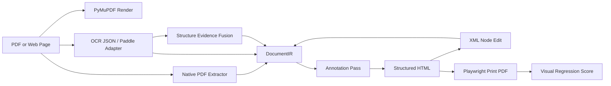

<p align="center">
  
</p>

<h1 align="center">Scriptorium PDF</h1>

<p align="center">
  <strong>把 PDF、网页打印 PDF 和 OCR 结构结果转换成可编辑、可标注、可回归评测的 HTML。</strong>
</p>

<p align="center">
  
  
  
  
</p>

## What It Does

Scriptorium PDF 是一个核心转换引擎，目标不是把 PDF 页面截图塞进 HTML，而是把 PDF 里的可识别结构转成可编辑节点：

- 从 PDF 提取 native text、字体、颜色、粗细、坐标、image block 和 drawing/shape。
- 从 OCR / PaddleOCR-VL / PP-Structure 输出归一化到同一个 `DocumentIR`。
- 生成 `structured` HTML：文本节点可编辑，图形节点保留结构，DOM 上带识别标记。
- 支持 XML 级局部节点编辑，再回写到 IR 并重新导出 HTML/PDF。
- 用 Playwright 打印网页或 HTML 为 PDF，再用渲染图对比生成相似度指标。
- 用 benchmark 记录优化前后的可比较分数。

它适合做 PDF 编辑、翻译、版面重建、OCR 结构验证、HTML-PDF 转换质量评测的底层实验平台。

## Core Requirements

Scriptorium 的实现围绕四个硬需求设计：

| Requirement | Meaning |
|---|---|
| Structured output | 产出的 HTML 需要有文本、shape、role、bbox、style id、source marker，而不是单张整页截图。 |
| Local editability | 每个可编辑文本节点都有稳定 element id，可通过 DOM 或 XML 精确修改局部内容。 |
| Source preservation | OCR/native 原文保存在 `source_text`，编辑写入 `edited_text`，翻译写入 `translated_text`，不覆盖原始识别结果。 |
| Measurable quality | 每次转换都能打印回 PDF 并计算 `visual_similarity`、diff 分布、页数匹配和尺寸匹配，后续优化用同一指标比较。 |

## Why It Is Different

很多 PDF-to-HTML 工具会先渲染整页图片，然后把透明文本覆盖上去。那种方式视觉上容易接近，但局部编辑能力很弱。

Scriptorium 的 `structured` 模式明确避免整页图片：

```html
<div
  data-scriptorium-role="table-cell-text"
  data-scriptorium-source="native-pdf"
  data-scriptorium-style-id="style-004"
  data-scriptorium-layout-group="table-001"
  data-scriptorium-layout-kind="table"
  data-scriptorium-layout-confidence="0.86"
  data-scriptorium-semantic-order="12"
  data-scriptorium-column-count="2"
  data-scriptorium-reading-order-strategy="recursive-xy-cut-v1"
  data-scriptorium-reading-order-region="root/h1/v0"
  data-scriptorium-edit-target="edited_text"
  data-bbox-pdf="76.99,212.49,117.83,224.22"
  contenteditable="true"
>
  PDF text
</div>
```

每个节点都能追溯到来源、坐标、样式桶、版面分组和编辑目标。普通 drawing 会保留为 SVG line/path；复杂矢量图会在局部区域触发 raster fallback，仍然是带 bbox/source metadata 的局部 image 节点，不是整页背景图。

## Real-World Scores

<p align="center">
  
</p>

| Sample | Pages | Elements | Editable | Images | Shapes | Multi-Col | Visual Similarity | Max Diff | Mean Diff | Page/Size Match |
|---|---:|---:|---:|---:|---:|---:|---:|---:|---:|---|
| Hacker News live page printed by Playwright | 2 | 162 | 95 | 30 | 37 | 0 | 0.9800288 | 0.0199712 | 0.01032101 | yes / yes |
| arXiv paper: Attention Is All You Need | 15 | 876 | 761 | 6 | 109 | 163 | 0.93202666 | 0.06797334 | 0.04206617 | yes / yes |
| ACL paper: Transformer-XL | 11 | 1558 | 1446 | 2 | 110 | 880 | 0.93358709 | 0.06641291 | 0.05013853 | yes / no |
| Built-in benchmark fixtures, mean | 6 pages total | 72 | 53 | 0 | 19 | 20 | 0.99036719 | 0.01183004 | 0.00960058 | yes / yes |

`visual_similarity = 1 - max_diff_ratio`。`max_diff_ratio` 现在包含页数缺失和页面尺寸不匹配惩罚；报告会同时输出 `mean_diff_ratio`、`p95_diff_ratio`、`worst_page`、`page_count_match` 和 `dimension_match`，避免错误页面被 resize 后看起来“相似”。

Transformer-XL 的 `dimension_match = false` 来自 Chromium 打印 A4 页面时产生的 1px 宽度量化差异；页数匹配，diff 仍按未拉伸画布严格比较。

内置 fixtures 同时带 `.semantic-order.json` ground truth。当前 `semantic_order_pair_accuracy = 1.0`，`semantic_sequence_similarity = 1.0`，覆盖 53 个期望文本节点；其中 20 个多栏文本节点由 `recursive-xy-cut-v1` 负责排序。arXiv Attention 论文有 repo 内部分人工 sidecar，覆盖 5 页、38 个关键文本点，`semantic_order_pair_accuracy = 1.0`。Transformer-XL 论文新增真实双栏 sidecar，覆盖 3 页、44 个关键文本点，`semantic_order_pair_accuracy = 1.0`。Hacker News 网页打印 PDF 覆盖 2 页、26 个关键文本点，`semantic_order_pair_accuracy = 1.0`。

最新 semantic benchmark 改进为网页打印 PDF 增加 parent-scoped sidecar，并把密集列表行桶从 12pt 收紧到 6pt，避免下一条列表编号插到上一条 metadata 前面。报告还输出 partial labels 忽略文本的 zone/role/source 分布：Attention 当前忽略 147 个未标注节点，Transformer-XL 忽略 277 个，web-HN 忽略 69 个 table-cell 节点，用于决定下一批人工 ground truth。视觉侧保持上一轮收益：arXiv Attention 论文从 `0.92601817` 提升到 `0.93202666`，Transformer-XL 从 `0.91825764` 提升到 `0.93358709`，网页打印 PDF 从 `0.97970864` 提升到 `0.9800288`。字体 profile A/B 显示 `local-urw` 能把 Attention 提到 `0.93871982`，但会把 Transformer-XL 拉低到 `0.90096092`，因此默认仍使用稳定的 `browser-default`，本地字体 profile 只作为显式实验选项。

<p align="center">
  
</p>

## Requirements

Required:

- Python `3.10+`
- Google Chrome / Chromium
- Playwright Python package
- PyMuPDF
- Pillow
- Pydantic
- Jinja2
- Typer

Optional:

- PaddleOCR / PaddleOCR-VL for local OCR and document structure experiments

Notes:

- `.env.example` is committed as a template.
- `.env`, `.venv/`, `data/`, and `outputs/` are intentionally ignored.
- Playwright is launched with `--no-proxy-server` by default in this repo because some environments inject proxy credentials into Chrome.

## Installation

```bash
python3 -m venv .venv
. .venv/bin/activate
pip install -r requirements.txt
pip install -e .
```

Optional OCR stack:

```bash
pip install -r requirements-ocr.txt
```

## Quick Start

Generate a deterministic PDF fixture:

```bash
scriptorium make-fixture --out-dir data/fixture
```

Convert it to IR:

```bash
scriptorium convert \
  data/fixture/sample.pdf \
  --ocr-json data/fixture/sample.ocr.json \
  --out-dir outputs/sample
```

External structure evidence from PaddleOCR-VL / PP-StructureV3 style JSON can be fused without making the model runtime a core dependency:

```bash
scriptorium convert \
  path/to/input.pdf \
  --structure-json path/to/paddle-or-ppstructure.json \
  --out-dir outputs/with-structure
```

Export HTML:

```bash
scriptorium export-html \
  outputs/sample/document.ir.json \
  --out-dir outputs/sample/html \
  --display-mode structured
```

Print HTML back to PDF and compare:

```bash
scriptorium print-pdf \
  outputs/sample/html/index.html \
  --pdf outputs/sample/export.pdf

scriptorium compare-pdf \
  data/fixture/sample.pdf \
  outputs/sample/export.pdf \
  --out-dir outputs/sample/pdf-quality
```

## Real Web Page Workflow

Capture a live page with Playwright:

```bash
scriptorium capture-pdf \
  https://news.ycombinator.com/ \
  --pdf outputs/external/web-hn/input.pdf \
  --mode print
```

Convert the captured PDF into annotated structured HTML:

```bash
scriptorium convert \
  outputs/external/web-hn/input.pdf \
  --out-dir outputs/external/web-hn/structured \
  --extract-mode native \
  --dpi 144

scriptorium export-html \
  outputs/external/web-hn/structured/document.ir.json \
  --out-dir outputs/external/web-hn/structured/html \
  --display-mode structured
```

Score the result:

```bash
scriptorium print-pdf \
  outputs/external/web-hn/structured/html/index.html \
  --pdf outputs/external/web-hn/structured/structured-export.pdf

scriptorium compare-pdf \
  outputs/external/web-hn/input.pdf \
  outputs/external/web-hn/structured/structured-export.pdf \
  --out-dir outputs/external/web-hn/structured/pdf-quality \
  --dpi 144
```

## Benchmark

Run the built-in multi-PDF benchmark:

```bash
scriptorium benchmark --out-dir outputs/benchmark-baseline --dpi 192
```

Run benchmark on your own PDFs:

```bash
scriptorium benchmark path/to/file1.pdf path/to/file2.pdf --out-dir outputs/my-benchmark --dpi 144
```

Try the local URW/DejaVu font fallback profile as an A/B experiment:

```bash
scriptorium benchmark path/to/paper.pdf \
  --font-profile local-urw \
  --out-dir outputs/font-profile-local-urw \
  --dpi 144
```

Run the same benchmark with external PaddleOCR-VL / PP-StructureV3 style evidence:

```bash
scriptorium benchmark \
  path/to/file1.pdf path/to/file2.pdf \
  --structure-json path/to/file1.structure.json \
  --structure-json path/to/file2.structure.json \
  --out-dir outputs/native-plus-structure \
  --dpi 144
```

For a single PDF, pass one `--structure-json`. For multiple PDFs, pass JSON files in PDF order or name them like `<pdf-stem>.structure.json` / `<parent-dir>.<pdf-stem>.structure.json` so the benchmark can match them.

Outputs:

- `benchmark_report.json`: full metrics, per-stage timings, artifact paths
- `benchmark_summary.csv`: compact table for tracking optimization progress
- per-case `document.ir.json`, `html/index.html`, `structured-export.pdf`, and visual diff images

Tracked metrics:

- `visual_similarity`
- `max_diff_ratio`
- `mean_diff_ratio`
- `p95_diff_ratio`
- `worst_page`
- page count match
- page dimension match
- image count
- multi-column element count
- column-flow element count
- recursive XY-Cut element count
- reading-order strategy counts
- font profile
- structure evidence source, region count, matched element count, and reordered page count
- semantic ground-truth case count
- semantic order pair accuracy
- semantic sequence similarity
- semantic ignored text count for partial labels
- semantic ignored text zone/role/source counts for partial labels
- semantic missing/extra text count
- `total_seconds`
- stage timings: render, extraction/annotation, HTML export, PDF print, visual comparison, semantic comparison
- element count
- editable element count
- shape count
- style count
- annotation count

## Architecture



Core files:

- `src/scriptorium/models.py`: `DocumentIR`, page and element models
- `src/scriptorium/native_pdf.py`: native text and drawing extraction
- `src/scriptorium/annotations.py`: role/style/source/bbox annotation pass
- `src/scriptorium/reading_order.py`: visual order, column-flow fallback, and recursive XY-Cut semantic order
- `src/scriptorium/structure_evidence.py`: PaddleOCR-VL/PP-Structure style external region/order evidence fusion
- `src/scriptorium/html_export.py`: standalone HTML export
- `src/scriptorium/xml_edit.py`: XML node edit round trip
- `src/scriptorium/benchmark.py`: reproducible quality benchmark
- `docs/optimization-roadmap.md`: reading-order and complex-page optimization plan

## Data Model

`DocumentIR` is the source of truth. It keeps:

- page size in PDF points and rendered pixels
- element bbox in PDF points and pixels
- `source_text`, `edited_text`, `translated_text`
- `text_runs` for native PDF inline spans: text, bbox, font, weight, style, color, script, and run style id
- `font_profile`: the CSS font fallback profile used during native PDF extraction
- native drawing SVG evidence: simple line points and non-rectangular path data
- native image/raster crops via `source_crop`
- `semantic_order`, `visual_order`, `column_index`, `column_count`, `flow_segment_index`, and `reading_order_region_path`
- optional external structure evidence such as `external_structure_label`, `external_structure_order`, and fused region metadata
- source kind: `native-pdf`, `native-image`, `native-raster-region`, `native-drawing`, OCR fallback, etc.
- role: `heading`, `paragraph`, `table-cell-text`, `table-shape`, `figure-shape`, `separator-shape`, etc.
- style bucket: `style-001`, `style-002`, ...
- layout group: for example `table-001`, `figure-001`, `separator-001`
- layout region metadata: region kind, bbox, confidence, and contributing shape ids
- revision history for edits and translation

The original `source_text` is never overwritten. Inline runs are used when rendering source text; once an element has `edited_text` or `translated_text`, Scriptorium renders the replacement as plain editable text instead of forcing old source runs onto new content.

## OCR And Structure Strategy

The default tested path uses native PDF extraction or JSON fallback. Heavy model runtimes remain optional, but their structured output can now assist the core pipeline:

- conversion, annotation, HTML export, XML edit, and benchmark do not depend on the model runtime
- `--font-profile browser-default` is the stable default; `--font-profile local-urw` can be benchmarked when local Nimbus/DejaVu fonts are available
- `--structure-json` accepts PaddleOCR-VL / PP-StructureV3 style JSON with region bbox, label, content, and block order
- `structure_evidence.py` aligns those regions back to native elements by bbox coverage/text similarity
- matched elements can receive external role/order metadata and `external-structure-fusion-v1` reading-order strategy
- `scriptorium benchmark --structure-json ...` reports whether those regions matched elements or changed page order, enabling native-only versus native-plus-structure A/B runs
- `requirements-ocr.txt` keeps heavyweight OCR dependencies optional

## Development

Run tests:

```bash
pytest
```

Current local test baseline:

```text
33 passed
```

## Project Status

This is a core-first prototype. It already has real PDF and real webpage benchmarks, stricter visual metrics, v2 layout grouping, native PDF span-level inline style preservation, PDF line-width alignment for structured text, native drawing SVG path output, native image extraction, local raster fallback for dense vector regions, recursive XY-Cut semantic order for sectioned multi-column pages, Paddle/PP-Structure style external evidence fusion, real-paper partial semantic ground truth, and strategy coverage metrics. The next useful work is running real model outputs through the fusion path, broader real-document semantic ground truth, richer OCR adapter mapping, and edit-aware reflow while keeping benchmark scores comparable.
