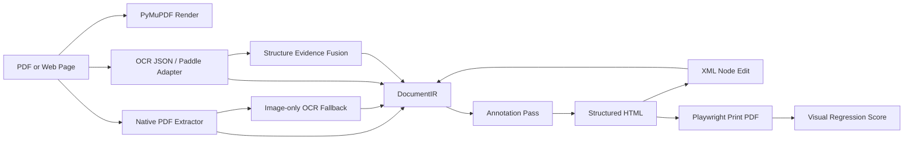

<p align="center">
  
</p>

<h1 align="center">Scriptorium PDF</h1>

<p align="center">
  <strong>把 PDF、网页打印 PDF 和 OCR 结构结果转换成可编辑、可标注、可回归评测的 HTML。</strong>
</p>

<p align="center">
  <a href="README.md"></a>
  <a href="README.en.md"></a>
</p>

<p align="center">
  
  
  
  
  
  
</p>

<p align="center">
  <a href="#快速开始">快速开始</a>
  ·
  <a href="#真实基准">真实基准</a>
  ·
  <a href="#核心架构">核心架构</a>
  ·
  <a href="#benchmark">Benchmark</a>
  ·
  <a href="docs/optimization-roadmap.zh-CN.md">优化路线</a>
</p>

<p align="center">
  <strong>Scriptorium PDF 面向 PDF 编辑、翻译、版面重建和 OCR 结构验证。</strong><br>
  它保留原始识别证据，把文本、坐标、样式、结构角色、阅读顺序和可编辑字段落到同一个 IR，再用可重复 benchmark 追踪每次优化是否真的变好。
</p>

<table>
  <tr>
    <td width="34%" valign="top">
      <strong>目标</strong><br>
      把 PDF、网页打印 PDF、扫描/截图 PDF 和外部 OCR 结构结果转换为带坐标证据的 HTML。
    </td>
    <td width="33%" valign="top">
      <strong>不是</strong><br>
      不是给单个样例手写样式，也不是只把整页截图包进 HTML 再叠一层不可维护的文字。
    </td>
    <td width="33%" valign="top">
      <strong>输出</strong><br>
      每个节点保留 bbox、role、style、source、reading order、编辑字段和翻译字段，便于继续回写 PDF。
    </td>
  </tr>
</table>

| 能力 | 当前状态 |
|---|---|
| 结构化 HTML | 文本、image、shape、layout group、role、bbox、style id、source marker 都进入 DOM 标记。 |
| 可编辑与翻译 | `source_text` 永久保留，编辑写入 `edited_text`，翻译写入 `translated_text`，支持 XML/IR 往返。 |
| OCR / 结构证据 | 支持 image-only OCR fallback，并可融合 PaddleOCR-VL / PP-Structure / Docling JSON。 |
| 视觉保真 | 支持 structured redraw、SVG/raster fidelity overlay、字体/字号/text-fit 自动基准比较。 |
| 语义顺序 | 支持 XY-Cut、多栏 flow、表格岛、页眉页脚、脚注、边栏、caption、reading stream、caption-target proximity、relation graph、structure-relation、successor consensus 诊断和保守 runtime 仲裁。 |
| 质量指标 | 同时输出 `visual_similarity`、diff 分布、semantic order、successor accuracy、候选仲裁和风险指标。 |

<table>
  <tr>
    <td width="50%" valign="top">
      <strong>中文文档</strong><br>
      <a href="README.md">默认中文首页</a> ·
      <a href="README.zh-CN.md">中文镜像</a> ·
      <a href="docs/implementation-notes.zh-CN.md">实现说明</a> ·
      <a href="docs/optimization-roadmap.zh-CN.md">优化路线</a> ·
      <a href="docs/external-benchmarks.zh-CN.md">外部基准</a>
    </td>
    <td width="50%" valign="top">
      <strong>English documentation</strong><br>
      <a href="README.en.md">English README</a> ·
      <a href="docs/implementation-notes.md">Implementation notes</a> ·
      <a href="docs/optimization-roadmap.md">Optimization roadmap</a> ·
      <a href="docs/external-benchmarks.md">External benchmarks</a>
    </td>
  </tr>
</table>

<table>
  <tr>
    <td width="50%">
      <br>
      <strong>网页 / 门户类 PDF</strong><br>
      Playwright 打印或截图生成 PDF 后，转换结果保留源视觉层，同时把 OCR/native 文本作为可编辑坐标锚点和 DOM 标注。
    </td>
    <td width="50%">
      <br>
      <strong>论文 / 年报 / 手册类 PDF</strong><br>
      每次优化都通过可重复 benchmark 输出视觉相似度、语义顺序、候选分歧、风险和耗时指标。
    </td>
  </tr>
</table>

## 项目定位

Scriptorium PDF 是一个核心转换引擎，目标不是把 PDF 页面截图塞进 HTML，而是把 PDF 里的可识别结构转成可编辑节点：

- 从 PDF 提取 native text、字体、颜色、粗细、坐标、image block 和 drawing/shape。
- 对没有原生文字且页面主要由图像构成的扫描/截图 PDF，自动补 `native-ocr` 透明编辑锚点。
- 从 OCR / PaddleOCR-VL / PP-Structure / Docling 输出归一化到同一个 `DocumentIR`。
- 生成 `structured` HTML：文本节点可编辑，图形节点保留结构，DOM 上带识别标记。
- 支持 XML 级局部节点编辑，再回写到 IR 并重新导出 HTML/PDF。
- 用 Playwright 打印网页或 HTML 为 PDF，再用渲染图对比生成相似度指标。
- 用 benchmark 记录优化前后的可比较分数。

它适合做 PDF 编辑、翻译、版面重建、OCR 结构验证、HTML-PDF 转换质量评测的底层实验平台。

重点不是给某个样例手写一套 HTML 样式，而是让工具自动识别并标记输出：bbox、role、layout group、style id、source kind、reading-order strategy、caption target、编辑/翻译字段都会进入 IR 和 HTML `data-scriptorium-*` 属性。

## 核心要求

Scriptorium 的实现围绕四个硬需求设计：

| Requirement | Meaning |
|---|---|
| Structured output | 产出的 HTML 需要有文本、shape、role、bbox、style id、source marker，而不是单张整页截图。 |
| Local editability | 每个可编辑文本节点都有稳定 element id，可通过 DOM 或 XML 精确修改局部内容。 |
| Source preservation | OCR/native 原文保存在 `source_text`，编辑写入 `edited_text`，翻译写入 `translated_text`，不覆盖原始识别结果。 |
| Measurable quality | 每次转换都能打印回 PDF 并计算 `visual_similarity`、diff 分布、页数匹配和尺寸匹配，后续优化用同一指标比较。 |

## 为什么不同

很多 PDF-to-HTML 工具会先渲染整页图片，然后把透明文本覆盖上去。那种方式视觉上容易接近，但局部编辑能力很弱。

Scriptorium 的 `structured` 模式明确避免整页图片：

```html
<div
  data-scriptorium-role="table-cell-text"
  data-scriptorium-source="native-pdf"
  data-scriptorium-style-id="style-004"
  data-scriptorium-layout-group="table-001"
  data-scriptorium-layout-kind="table"
  data-scriptorium-layout-confidence="0.86"
  data-scriptorium-semantic-order="12"
  data-scriptorium-column-count="2"
  data-scriptorium-reading-order-strategy="recursive-xy-cut-v1"
  data-scriptorium-reading-order-region="root/h1/v0"
  data-scriptorium-reading-order-scope="body"
  data-scriptorium-reading-order-sidebar=""
  data-scriptorium-reading-order-stream-id="body-main"
  data-scriptorium-reading-order-stream-type="body"
  data-scriptorium-reading-order-stream-index="12"
  data-scriptorium-reading-order-confidence="0.83"
  data-scriptorium-reading-order-evidence="recursive-xy-cut,horizontal-whitespace-cut,vertical-whitespace-cut"
  data-scriptorium-edit-target="edited_text"
  data-scriptorium-translation-target="translated_text"
  data-scriptorium-translation-stream-id="body-main"
  data-scriptorium-translation-stream-type="body"
  data-bbox-pdf="76.99,212.49,117.83,224.22"
  contenteditable="true"
>
  PDF text
</div>
```

每个节点都能追溯到来源、坐标、样式桶、版面分组和编辑目标。普通 drawing 会保留为 SVG line/path；复杂矢量图会在局部区域触发 raster fallback，仍然是带 bbox/source metadata 的局部 image 节点，不是整页背景图。

## 真实基准

<p align="center">
  
</p>

| Sample | Pages | Elements | Editable | Images | Shapes | Multi-Col | Visual Similarity | Max Diff | Mean Diff | Page/Size Match |
|---|---:|---:|---:|---:|---:|---:|---:|---:|---:|---|
| Hacker News live page printed by Playwright | 2 | 162 | 95 | 30 | 37 | 0 | 0.9800288 | 0.0199712 | 0.01032101 | yes / yes |
| arXiv paper: Attention Is All You Need | 15 | 876 | 761 | 6 | 109 | 163 | 0.96840246 | 0.03159754 | 0.02179977 | yes / yes |
| ACL paper: Transformer-XL | 11 | 1558 | 1446 | 2 | 110 | 1213 | 0.95679576 | 0.04320424 | 0.0365879 | yes / yes |
| Built-in benchmark fixtures, mean | 6 pages total | 72 | 53 | 0 | 19 | 20 | 0.9906702 | 0.01160961 | 0.00929831 | yes / yes |

`visual_similarity = 1 - max_diff_ratio`。`max_diff_ratio` 现在包含页数缺失和页面尺寸不匹配惩罚；报告会同时输出 `mean_diff_ratio`、`p95_diff_ratio`、`worst_page`、`page_count_match` 和 `dimension_match`，避免错误页面被 resize 后看起来“相似”。

Transformer-XL 这类 A4 变体页面曾受 Chromium 打印 1px 宽度量化影响；benchmark 现在会在打印后把导出 PDF 的 page box 归一到源页面尺寸，避免尺寸误差污染后续视觉指标。

内置 fixtures 同时带 `.semantic-order.json` ground truth。当前 `semantic_order_pair_accuracy = 1.0`，`semantic_successor_accuracy = 1.0`，`semantic_sequence_similarity = 1.0`，覆盖 53 个期望文本节点和 47 条相邻后继边；其中 20 个多栏文本节点由 `recursive-xy-cut-v1` 负责排序。arXiv Attention 论文有 repo 内部分人工 sidecar，覆盖 5 页、38 个关键文本点，本轮 successor benchmark 保持 `semantic_order_pair_accuracy = 1.0`、`semantic_successor_accuracy = 1.0`，33/33 条相邻后继边正确。Transformer-XL 论文新增真实双栏 sidecar，覆盖 3 页、44 个关键文本点，本轮 successor benchmark 保持 `semantic_order_pair_accuracy = 1.0`、`semantic_successor_accuracy = 1.0`，41/41 条相邻后继边正确。Hacker News 网页打印 PDF 覆盖 2 页、26 个关键文本点，本轮 successor benchmark 保持 `semantic_order_pair_accuracy = 1.0`、`semantic_successor_accuracy = 1.0`，24/24 条相邻后继边正确。

最新 semantic benchmark 改进为网页打印 PDF 增加 parent-scoped sidecar，并把密集列表行桶从 12pt 收紧到 6pt，避免下一条列表编号插到上一条 metadata 前面。报告还输出 partial labels 忽略文本的 zone/role/source 分布，以及 `semantic_successor_accuracy` / successor edge counts：未标注文本插入不会扣分，已标注相邻节点错位或缺失会扣分。这让后续 relation-graph 排序可以用局部后继边而不只看全局 pairwise 分数。Attention 当前忽略 147 个未标注节点，Transformer-XL 忽略 277 个，web-HN 忽略 69 个 table-cell 节点，用于决定下一批人工 ground truth。Transformer-XL 的混合版面保护已放宽为“强重复栏锚点可越过表格 guard”，多栏覆盖从 880 增至 1213，阅读风险从 `0.17061801 / medium` 降到 `0.08879982 / low`。`column-flow-v1` 现在可以从重复左边界锚点识别最多三列文本流，并用短单元格宽度过滤避免把纯表格读成列。`spatial-graph-v1` 是更保守的弱列 fallback：当重复左边界聚类不足、页面又不像纯表格时，它用上下邻接和水平重叠关系串联列内链，并要求链覆盖率、列间距和垂直重叠同时达标。`box-flow-v1` 是新的受控 fallback：当表格、重复锚点列流和空间图都没有接受页面时，它按 full-width break 分段，比较 visual-yx 和 column-biased box-flow 候选，只在候选分歧、分列平衡、垂直重叠和列间距同时成立时接管弱列段。caption-flow 现在把 native/OCR 文本里的 `Figure/Fig./Table/Algorithm + 编号` 作为浅结构证据：局部 caption 仍留在所属列，跨 gutter 的 caption 会成为局部 flow break，并以 `reading_order_caption_type`、`caption-label`、`cross-column-caption` 等证据进入 IR/HTML/benchmark。benchmark 继续记录 box-flow pairwise disagreement 和 successor-edge disagreement，用来发现论文/复杂网页上是否存在值得模型或结构证据复核的替代顺序假设。`mixed-table-column-flow-v1` 进一步识别页面内部的局部表格岛：表格岛内部保持 row-major，周围正文仍可按多栏流排序，并通过 `reading_order_region_path = root/table-island-###` 标记；带重复 x-slot 的公式碎片会被排除，避免把论文公式读成表格。`mixed-grid-column-flow-v1` 则识别非表格的重复卡片/门户网格岛，使用 `root/grid-island-###`、`grid-island-row-major` 和 `local-structure-grid` 证据保留局部 row-major 翻译流，但不会把商品/导航卡片误标成表格。纯表格页现在会显式标为 `table-row-major-v1`，用 `table-row-major` / `table-grid-slots` 证据说明这是有意保留的行优先顺序，不再混入未知 `visual-yx` fallback。页边 running header/footer 现在会标记为 `reading_order_scope = page-artifact`，并从正文列聚类中剥离。页面印刷区外的窄边栏/旁注会标记为 `reading_order_scope = sidebar`、`reading_order_sidebar_type = left|right`，从正文列聚类中剥离并排在主叙事流之后。页底脚注会标记为 `reading_order_scope = footnote`，从正文列聚类中剥离，并在正文之后、边栏和页脚 artifact 之前进入语义顺序。视觉侧的主要瓶颈已经转向字体/浏览器重绘差异和正文行宽度拟合：`--text-fit auto` 会比较普通 HTML 文本和 bbox 内 SVG `textLength` 拟合层。它在论文类样本上选择 `0.99 + svg`，把 Attention 从 `0.93670278` 提升到 `0.96840246`，把 Transformer-XL 从 `0.93358709` 提升到 `0.95679576`；网页打印 PDF 自动保留 `none`，维持 `0.9800288`。

Reading-order 输出现在还有 page-local reading stream 元数据：`reading_order_stream_id`、`reading_order_stream_type` 和 `reading_order_stream_index`。主正文通常是 `body-main`，脚注、左右边栏、页眉页脚 artifact、caption、表格岛和非表格卡片网格岛会进入独立局部流。它借鉴 PDF article threads 的思路：复杂页面可以有多条可导航阅读路径，而不是只能暴露一个全局序列。

正文流现在会在有明确结构断点时按 segment 拆分：第一条连续正文链保留 `body-main`，后续正文链会标成 `body-segment-002`、`body-segment-003` 等。触发条件来自 full-width flow break 或多个 recursive XY-Cut 区域；只有标题加一段正文的普通页面不会被无谓拆开。

Semantic sidecar 现在也支持关系式标签和 stream-aware 标签：`successor_edges` 用于标注相邻 labelled 节点，`precedence_edges` 用于标注局部先后约束，`reading_streams` / `streams` 用于把正文、边栏、脚注、caption、表格岛或卡片网格岛拆成独立局部链。复杂页面可以只标正文链、边栏链、caption 到对象附近文本等关键关系，而不必把整页压成唯一 `text_sequence`。

Relation-graph 候选排序现在也进入 benchmark 诊断。`infer_relation_graph_order()` 会从 bbox 几何构建局部 successor 边，用 degree-constrained path cover 和 max-regret 选边串成阅读链；它目前只作为候选/诊断，不替换已选择的 `semantic_order`。这个指标用于判断某类页面是否值得引入更强的模型结构证据或候选 arbitration，而不是用单个样本倒推规则。

Structure-relation 候选现在进入 semantic candidate benchmark。它把页眉页脚、脚注、边栏、caption-target proximity 和正文 relation-graph 串联起来，生成一个结构感知候选顺序；目前只做 sidecar 打分和候选诊断，不改变 runtime 默认顺序。

Successor-consensus 候选现在把 visual-yx、box-flow、relation-graph、structure-relation 和 external-structure 的相邻后继边作为投票来源，用 acyclic path-cover 生成一个共识顺序。它同样只作为候选/诊断输出，用来观察多个独立候选是否支持同一局部阅读链。benchmark 还会记录 candidate count、selected-edge support、edge coverage、conflicted-edge ratio 和 high/medium/low agreement page counts，为后续 runtime arbitration 做基础。

`successor-consensus-arbitration-v1` 现在是一个保守的 runtime 仲裁路径：只在页面原本会落回弱 `single-column-visual-order`、非 visual 候选（box-flow 与 relation-graph）高度一致、与 visual-yx 存在相邻后继分歧，并且共识顺序出现明确跨栏回跳时才接管。它用于少量行/稀疏多栏页面，并会从多个 handoff 还原 `column_count` / `column_index` 元数据，不会替代表格、XY-Cut、column-flow、spatial-graph、box-flow、脚注、边栏或外部结构证据路径。

页级候选仲裁诊断现在也会在没有 semantic sidecar 的 PDF 上工作。benchmark 会逐页比较 selected semantic order 与 successor-consensus 候选，输出 `reading_order_candidate_page_diagnostics`，并汇总 `reading_order_candidate_page_recommendation_counts`。推荐值包括 `keep-selected-supported`、`keep-selected-low-consensus`、`review-consensus`、`review-disagreement`、`needs-structure-evidence` 和 `unavailable`；它们用于安排复核/模型证据补充，不会自动改写转换结果。

复杂页面上还会按 `reading_order_stream_id` 做流内候选诊断：`reading_order_candidate_stream_diagnostics`、`reading_order_candidate_stream_count` 和 `reading_order_candidate_stream_recommendation_counts` 会分别记录每个 local stream 内的候选冲突、推荐和汇总建议数，避免 sidebar/脚注等局部流的分歧被主正文页级统计掩盖。

Semantic sidecar 现在还能对候选顺序直接打分。benchmark 会为有 ground truth 的页面同时评估 selected semantic order、visual-yx、box-flow、relation-graph、structure-relation、successor-consensus，以及可用时的 external-structure order 的 `semantic_*_order_pair_accuracy` 与 `semantic_*_successor_accuracy`，并记录 `semantic_best_candidate_by_successor`。这一步把“候选分歧诊断”推进成“候选能否接近人工语义顺序”的可复用证据，但仍不自动改写输出顺序。

候选仲裁诊断现在会进一步输出 `semantic_candidate_arbitration_recommendation`、`semantic_candidate_successor_delta` 和 `semantic_candidate_pairwise_delta`。当 labelled sidecar 显示候选确实优于 selected order 时，报告会标为 `consider-<candidate>`；否则保持 `keep-selected`。这仍是 benchmark 证据层，不会在转换时自动切换顺序。

首个 semantic candidate baseline 记录在 `outputs/benchmark-semantic-candidate-metrics-v1`：内置 fixtures 的 selected order 仍为 `semantic_successor_accuracy = 1.0`，候选顺序中 visual-yx 为 34/47，box-flow 为 28/47，relation-graph 为 44/47。`semantic_best_candidate_by_successor_counts` 为 `relation_graph: 2`、`visual_yx: 3`，说明 relation-graph 是有价值的候选，但还不能无条件替换 selected semantic order。

`outputs/benchmark-semantic-arbitration-v1` 进一步记录首个仲裁诊断基线：5 个内置 fixture 全部是 `keep-selected`，平均 best-candidate successor delta 为 `-0.06`，平均 pairwise delta 为 `-0.02181818`。这说明诊断层能识别“候选接近但不应接管”的情况。

Reading-order 输出现在带有可解释证据和启发式置信度：`reading_order_confidence`、`reading_order_evidence`、`reading_order_evidence_summary` 会进入 IR、annotation 和 HTML `data-scriptorium-*` 属性。benchmark 同步汇总 `reading_order_mean_confidence`、`reading_order_low_confidence_element_count`、`reading_order_stream_count`、`reading_order_stream_type_counts`、`grid_island_element_count`、`table_row_major_element_count`、`spatial_graph_element_count`、`box_flow_element_count`、`successor_consensus_arbitration_element_count`、`reading_order_caption_element_count`、`reading_order_box_flow_disagreement_ratio`、`reading_order_box_flow_successor_disagreement_ratio`、`reading_order_relation_graph_disagreement_ratio`、`reading_order_relation_graph_successor_disagreement_ratio`、`reading_order_successor_consensus_disagreement_ratio`、`reading_order_successor_consensus_successor_disagreement_ratio`、`reading_order_successor_consensus_selected_edge_support_ratio`、`reading_order_successor_consensus_selected_edge_coverage_ratio`、`reading_order_successor_consensus_conflicted_edge_ratio`、`reading_order_candidate_page_recommendation_counts`、`reading_order_candidate_stream_recommendation_counts`、`semantic_candidate_order_metrics`、`semantic_candidate_arbitration_recommendation`、`semantic_best_candidate_by_successor`、`semantic_stream_successor_accuracy`、`semantic_candidate_stream_successor_delta`、`reading_order_footnote_element_count`、`reading_order_sidebar_element_count`、`reading_order_evidence_counts`、`semantic_successor_accuracy` 和 successor edge counts。内置 fixtures relation-graph diagnostics v1 结果保持 `visual_similarity = 0.9906702`、`semantic_order_pair_accuracy = 1.0`、`semantic_successor_accuracy = 1.0`，box-flow 候选 successor disagreement 为 19/47，relation-graph 候选 successor disagreement 为 3/47，18 个表格文本节点标为 `table-row-major-v1`，平均 reading-order confidence 保持 `0.80113208`，风险保持 `0`，所有 fixture 都是 low risk。

`--html-mode fidelity` 是高保真 overlay 路径：HTML 可见层使用每页 SVG 或 raster 背景，识别出的文本/结构节点仍以透明 `contenteditable` 坐标锚点存在；未编辑时打印只输出背景层，已编辑或已翻译节点会作为局部白底 replacement layer 打印。HTML 还显式暴露 `data-scriptorium-translation-target`、`data-scriptorium-translation-stream-id` 和 `data-scriptorium-translation-stream-type`，翻译流水线可以按正文、边栏、表格岛或卡片网格岛分批翻译，再写回 `translated_text` 进行回渲染。`--html-mode auto --fidelity-background auto` 会同时比较 structured redraw、SVG fidelity 和 raster fidelity，并保留更高分候选：

Fidelity replacement 节点现在会导出 `data-scriptorium-replacement-policy`、`data-scriptorium-replacement-fit-scale`、`data-scriptorium-replacement-mask-padding`、`data-scriptorium-replacement-overflow`、`data-scriptorium-replacement-conflict` 和 `data-scriptorium-replacement-conflict-ids`。导出器会为 edited/translated 文本扩展局部白底 mask、用 padding 把文本放回原始坐标、按 bbox 自动缩小长译文，并在 replacement mask 与相邻元素冲突或仍然溢出时标记需要复核。

Benchmark 会同步输出 `fidelity_replacement_element_count`、`fidelity_replacement_overflow_count`、`fidelity_replacement_conflict_count`、`fidelity_replacement_conflict_target_count`、`fidelity_replacement_min_fit_scale`、`fidelity_replacement_mean_fit_scale` 和 `fidelity_replacement_policy_counts`，用于在翻译写回后量化“看起来像原 PDF”之外的 replacement 风险。

| Sample | Best structured | SVG fidelity | Raster fidelity | Auto selected | Selected path |
|---|---:|---:|---:|---:|---|
| arXiv paper: Attention Is All You Need | 0.96840246 | 0.98809524 | 1.0 | 1.0 | `fidelity/raster` |
| ACL paper: Transformer-XL | 0.95679576 | 0.97636829 | 0.98096887 | 0.98096887 | `fidelity/raster` |
| Hacker News live page printed by Playwright | 0.9800288 | 0.99490923 | 1.0 | 1.0 | `fidelity/raster` |
| Three-sample mean | 0.96840901 | 0.98645759 | 0.99365629 | 0.99365629 | mixed |

Additional complex baselines now cover a public company annual report and an image-only ecommerce homepage screenshot:

| Sample | Source | Pages Scored | Selected Path | Visual Similarity | Elements | Editable | OCR Text | Mixed Table Flow | Page Artifacts | Footnotes | Sidebars | Images | Shapes | Semantic GT |
|---|---|---:|---|---:|---:|---:|---:|---:|---:|---:|---:|---:|---:|---|
| PUMA 2024 Annual Report | public annual report PDF | 12 / 345 | `fidelity/raster` | 0.9795117 | 815 | 521 | 0 | 238 | 20 | 2 | 36 | 15 | 279 | no |
| JD homepage full screenshot PDF | Playwright full-page screenshot | 1 / 1 | `fidelity/raster` | 0.99576887 | 135 | 134 | 134 | 0 | 0 | 0 | 0 | 1 | 0 | no |

JD is intentionally an image-only PDF. The visual score stayed effectively unchanged after OCR fallback, but the output now contains 134 editable `native-ocr` anchors while preserving the original screenshot as the visible layer. PUMA keeps 0 OCR fallback pages because its sampled pages already contain native PDF text. Its latest reading-order diagnostics are better without changing the pixel score: `mixed-table-column-flow-v1` handles 238 elements, 20 running-header candidates are marked as page artifacts, 36 right-side sidebar/marginalia elements and 2 bottom-zone footnote elements are routed as secondary flow, table-like pages dominated by visual order drop to 0, and risk is now `0.35 / high`.

Current reading-order fallback/caption spot checks:

| Sample | Visual Similarity | Semantic Order | Successor Edges | Reading Risk | RO Confidence | Captions | Box-Flow Elements | Box-Flow Disagreement | Box-Flow Successor Disagreement | Spatial Graph | Table Row-Major | Footnotes | Sidebars | Evidence Highlights |
|---|---:|---:|---:|---|---:|---:|---:|---:|---:|---:|---:|---:|---:|---|
| Built-in fixtures | 0.9906702 | 1.0 | 47/47 | `5 low` | 0.80113208 | 0 | 0 | 0.19494585 | 19/47 | 0 | 18 | 0 | 0 | `table-row-major`, `recursive-xy-cut`, whitespace cuts |
| Transformer-XL first 3 pages | 0.98160664 | 1.0 | 41/41 | `0.21573209 / medium` | 0.9552648 | 3 figure, 1 cross-column | 0 | 0.0825672 | 142/318 | 0 | 0 | 7 | 0 | `column-flow`, `caption-label`, `cross-column-caption`, `footnote-secondary-flow` |
| PUMA 2024 Annual Report first 12 pages | 0.9795117 | n/a | n/a | `0.35 / high` | 0.82476488 | 0 | 0 | 0.17460108 | 199/509 | 0 | 0 | 2 | 36 right | `sidebar-secondary-flow`, `footnote-secondary-flow`, `table-island-row-major` |
| JD homepage screenshot PDF | 0.99576887 | n/a | n/a | `0.35 / high` | 0.83 | 0 | 0 | 0.42778588 | 127/133 | 0 | 0 | 0 | 0 | `recursive-xy-cut`, OCR coordinate anchors |

The current public benchmark set does not trigger `spatial-graph-v1` or `box-flow-v1`; stronger existing paths cover these pages first. Both fallbacks are covered by dedicated weak-column unit tests, and `spatial_graph_element_count` / `box_flow_element_count` are reported so future PDFs can show whether these paths are carrying real pages.
Box-flow disagreement is a diagnostic, not a correctness score. Pairwise disagreement measures broad order difference; successor disagreement measures immediate next-node edge difference and is closer to relation-graph/path-cover evaluation. JD's 127/133 successor disagreement makes it the clearest current target for sidecar labels or external structure evidence.

Relation-graph candidate diagnostics compare the selected semantic order against a geometry-only successor graph:

| Sample | Relation Pairwise Disagreement | Relation Successor Disagreement | Box-Flow Successor Disagreement | Interpretation |
|---|---:|---:|---:|---|
| Built-in fixtures | 6/277 | 3/47 | 19/47 | improves local successor continuity without changing fixture semantics |
| Transformer-XL first 3 pages | 3526/17077 | 111/318 | 142/318 | lower local disagreement than box-flow, but broad pairwise disagreement stays too high for default selection |
| PUMA 2024 Annual Report first 12 pages | 2473/15166 | 166/509 | 199/509 | useful candidate signal for annual-report sidecar/model evidence |
| JD homepage screenshot PDF | 1927/8911 | 117/133 | 127/133 | dense OCR/web order remains high risk and needs semantic labels or external structure evidence |

The relation graph is deliberately diagnostic-only. It improves local successor disagreement on current complex samples, but candidate arbitration still needs semantic sidecars or Paddle/PP-Structure/Docling-style structure evidence before it can safely override the selected order.

<p align="center">
  
</p>

## 环境要求

必需环境：

- Python `3.10+`
- Google Chrome / Chromium
- Playwright Python package
- PyMuPDF
- Pillow
- Pydantic
- Jinja2
- Typer

可选能力：

- PaddleOCR / PaddleOCR-VL for local OCR and document structure experiments
- Tesseract OCR binary and language data for PyMuPDF image-only OCR fallback, for example `eng` and `chi_sim`

说明：

- `.env.example` is committed as a template.
- `.env`, `.venv/`, `data/`, and `outputs/` are intentionally ignored.
- Playwright is launched with `--no-proxy-server` by default in this repo because some environments inject proxy credentials into Chrome.

## 安装

```bash
python3 -m venv .venv
. .venv/bin/activate
pip install -r requirements.txt
pip install -e .
```

Optional OCR stack:

```bash
pip install -r requirements-ocr.txt
```

Image-only OCR fallback 使用 PyMuPDF 的 Tesseract bridge，因此也需要系统 `tesseract` 命令和对应语言数据。如果 Tesseract 不可用，`--ocr-fallback off` 可以保持转换确定性，benchmark 仍会报告 textless / image-only 页面。

## 快速开始

生成一个确定性的 PDF fixture：

```bash
scriptorium make-fixture --out-dir data/fixture
```

转换为 IR：

```bash
scriptorium convert \
  data/fixture/sample.pdf \
  --ocr-json data/fixture/sample.ocr.json \
  --out-dir outputs/sample
```

External structure evidence from PaddleOCR-VL / PP-StructureV3 / Docling JSON can be fused without making the model runtime a core dependency:

```bash
scriptorium convert \
  path/to/input.pdf \
  --structure-json path/to/paddle-ppstructure-or-docling.json \
  --out-dir outputs/with-structure
```

匹配到的外部 label 现在不仅会影响 role/order，也会进入 reading stream：header/footer/page-number 会变成 page-artifact stream，footnote/sidebar 会变成局部 secondary stream，caption 会变成 caption stream，table 会变成 table-island stream，明确的 card/grid/product/tile 类区域会变成 `grid-island` 翻译流。普通 `list` 不会自动当作 grid，避免把新闻列表误标成卡片网格。

导出 HTML：

```bash
scriptorium export-html \
  outputs/sample/document.ir.json \
  --out-dir outputs/sample/html \
  --display-mode structured
```

把 HTML 打印回 PDF 并进行对比：

```bash
scriptorium print-pdf \
  outputs/sample/html/index.html \
  --pdf outputs/sample/export.pdf

scriptorium compare-pdf \
  data/fixture/sample.pdf \
  outputs/sample/export.pdf \
  --out-dir outputs/sample/pdf-quality
```

## 真实网页流程

使用 Playwright 捕获真实网页：

```bash
scriptorium capture-pdf \
  https://news.ycombinator.com/ \
  --pdf outputs/external/web-hn/input.pdf \
  --mode print
```

把捕获到的 PDF 转成带标注的结构化 HTML：

```bash
scriptorium convert \
  outputs/external/web-hn/input.pdf \
  --out-dir outputs/external/web-hn/structured \
  --extract-mode native \
  --dpi 144

scriptorium export-html \
  outputs/external/web-hn/structured/document.ir.json \
  --out-dir outputs/external/web-hn/structured/html \
  --display-mode structured
```

对结果评分：

```bash
scriptorium print-pdf \
  outputs/external/web-hn/structured/html/index.html \
  --pdf outputs/external/web-hn/structured/structured-export.pdf

scriptorium compare-pdf \
  outputs/external/web-hn/input.pdf \
  outputs/external/web-hn/structured/structured-export.pdf \
  --out-dir outputs/external/web-hn/structured/pdf-quality \
  --dpi 144
```

## Benchmark

运行内置多 PDF benchmark：

```bash
scriptorium benchmark --out-dir outputs/benchmark-baseline --dpi 192
```

Run benchmark on your own PDFs:

```bash
scriptorium benchmark path/to/file1.pdf path/to/file2.pdf --out-dir outputs/my-benchmark --dpi 144
```

对于很大的外部文档，可以只评分稳定的前若干页：

```bash
scriptorium benchmark path/to/annual-report.pdf \
  --max-pages 12 \
  --html-mode auto \
  --fidelity-background auto \
  --out-dir outputs/annual-report-benchmark \
  --dpi 144
```

用本地 URW/DejaVu 字体 fallback profile 做 A/B 实验：

```bash
scriptorium benchmark path/to/paper.pdf \
  --font-profile local-urw \
  --out-dir outputs/font-profile-local-urw \
  --dpi 144
```

Run a benchmark-time font calibration sweep and keep the better per-PDF result:

```bash
scriptorium benchmark path/to/paper.pdf \
  --font-profile auto \
  --out-dir outputs/font-profile-auto \
  --dpi 144
```

`auto` runs both `browser-default` and `local-urw` candidates, writes both candidate artifacts under the case directory, and selects the higher `visual_similarity` result for the report. In the current real-sample sweep, it selected `local-urw` for Attention (`0.93202666 -> 0.93871982`) and kept `browser-default` for Transformer-XL (`0.93358709`) and Hacker News (`0.9800288`).

Run a lightweight font-size calibration sweep:

```bash
scriptorium benchmark path/to/paper.pdf \
  --font-size-scale auto \
  --out-dir outputs/font-size-scale-auto \
  --dpi 144
```

`--font-size-scale auto` evaluates `0.99` and `1.0`, records candidate artifacts, and selects the higher score. It improved the Attention sample with `browser-default` from `0.93202666` to `0.93670278`, while keeping Transformer-XL and Hacker News at `1.0`.

Run a structured text-fit sweep:

```bash
scriptorium benchmark path/to/paper.pdf \
  --text-fit auto \
  --out-dir outputs/text-fit-auto \
  --dpi 144
```

`--text-fit auto` evaluates the normal editable HTML text layer and an SVG fitted text layer. The SVG candidate uses each PDF text bbox/run bbox plus `textLength` / `lengthAdjust="spacingAndGlyphs"` to match line width while keeping a transparent editable proxy in the DOM. Combined with `--font-size-scale auto`, it raised the current structured paper scores to Attention `0.96840246` and Transformer-XL `0.95679576`; Hacker News selected `none` because its normal HTML text remains closer.

Run an HTML-mode sweep for complex pages:

```bash
scriptorium benchmark path/to/paper.pdf \
  --html-mode auto \
  --fidelity-background auto \
  --font-size-scale auto \
  --text-fit auto \
  --out-dir outputs/html-mode-auto \
  --dpi 144
```

`--html-mode auto` benchmarks structured redraw plus fidelity overlay candidates, and `--fidelity-background auto` lets fidelity mode choose SVG or raster page backgrounds by score. The selected fidelity candidate still carries editable/annotated coordinate nodes in the HTML; unchanged nodes are hidden on print and edited/translated nodes print as replacement overlays.

也可以组合多个校准轴：

```bash
scriptorium benchmark path/to/paper.pdf \
  --font-profile auto \
  --font-size-scale auto \
  --text-fit auto \
  --out-dir outputs/visual-calibration-auto \
  --dpi 144
```

运行高保真 overlay benchmark：

```bash
scriptorium benchmark path/to/paper.pdf \
  --html-mode fidelity \
  --fidelity-background auto \
  --out-dir outputs/fidelity-overlay \
  --dpi 144
```

这个模式会在 HTML 中保留可编辑坐标节点，但打印时隐藏未编辑节点，因此分数衡量的是源视觉保真度。SVG 背景保留矢量和缩放友好特性；raster 背景通常在复杂页面上获得更严格的像素一致性。这个模式用于把未来 edit-mask / replacement 架构和完全结构化重绘路径分开评测。

native extraction 默认启用 image-only OCR fallback，并且只在页面没有 native text 且图像覆盖率很高时触发：

```bash
scriptorium benchmark path/to/scanned-or-screenshot.pdf \
  --ocr-fallback image-only \
  --ocr-language eng+chi_sim \
  --ocr-dpi 144 \
  --html-mode auto \
  --fidelity-background auto \
  --out-dir outputs/image-only-ocr \
  --dpi 144
```

使用 `--ocr-fallback off` 可以在不增加 OCR 文本锚点的情况下评估源视觉保真。

使用外部 PaddleOCR-VL / PP-StructureV3 / Docling 证据运行同一 benchmark：

```bash
scriptorium benchmark \
  path/to/file1.pdf path/to/file2.pdf \
  --structure-json path/to/file1.structure.json \
  --structure-json path/to/file2.structure.json \
  --out-dir outputs/native-plus-structure \
  --dpi 144
```

单个 PDF 传一个 `--structure-json`。多个 PDF 可以按 PDF 顺序传多个 JSON，或者把文件命名为 `<pdf-stem>.structure.json` / `<parent-dir>.<pdf-stem>.structure.json`，benchmark 会自动匹配。

对比 native-only 和 native-plus-structure：

```bash
scriptorium benchmark-structure-ab \
  path/to/input.pdf \
  --structure-json path/to/input.structure.json \
  --out-dir outputs/structure-ab \
  --dpi 144
```

该命令会写出 `structure_ab_report.json` 和 `structure_ab_summary.csv`，直接比较 visual similarity、reading-order risk、grid-island 元素、结构匹配数，以及 page/stream `needs-structure-evidence` 推荐数的变化。

输出：

- `benchmark_report.json`: full metrics, per-stage timings, artifact paths
- `benchmark_summary.csv`: compact table for tracking optimization progress
- per-case `document.ir.json`, `html/index.html`, exported PDF (`structured-export.pdf` or `fidelity-*-export.pdf`), and visual diff images

追踪指标：

- `visual_similarity`
- `max_diff_ratio`
- `mean_diff_ratio`
- `p95_diff_ratio`
- `worst_page`
- page count match
- page dimension match
- max pages limit when `--max-pages` is used
- image count
- multi-column element count
- column-flow element count
- mixed table/column-flow element count
- table row-major element count
- spatial graph element count
- box-flow fallback element count
- successor-consensus arbitration element count
- recursive XY-Cut element count
- reading-order page artifact count
- reading-order footnote element count
- reading-order sidebar element count
- reading-order stream count and stream type counts
- reading-order caption element count and caption type counts
- reading-order strategy counts
- reading-order mean confidence, low-confidence element count, and evidence counts
- reading-order box-flow, relation-graph, and successor-consensus candidate pair count, successor edge count, disagreement counts/page counts, disagreement ratios, consensus support/coverage/conflict ratios, and agreement page counts
- reading-order candidate page diagnostics and recommendation counts for selected-vs-consensus triage
- reading-order risk score, risk level, text-flow column geometry, repeated-anchor columns, table-like page count, and unlabeled-text risk count
- font profile
- font profile candidate scores when `--font-profile auto` is used
- font size scale and candidate scores when `--font-size-scale auto` is used
- text fit strategy and candidate scores when `--text-fit auto` is used
- HTML mode and vector background page count
- fidelity background strategy and candidate scores when `--fidelity-background auto` is used
- raster policy
- text run count
- mixed inline style element count
- layout region counts
- raster fallback count and rasterized text/image/shape counts
- OCR fallback policy, applied page count, OCR text count, image-only candidate pages, and textless page count
- structure evidence source, region count, matched element count, and reordered page count
- semantic ground-truth case count
- semantic order pair accuracy
- semantic successor accuracy and successor correct/total edge counts
- semantic relation successor / precedence accuracy and relation missing-text counts
- semantic candidate order metrics for visual-yx, box-flow, relation-graph, structure-relation, successor-consensus, and external-structure order when ground truth is available
- semantic best candidate by successor accuracy
- semantic candidate arbitration recommendation and candidate-vs-selected deltas
- semantic sequence similarity
- semantic ignored text count for partial labels
- semantic ignored text zone/role/source counts for partial labels
- semantic missing/extra text count
- `total_seconds`
- stage timings: render, extraction/annotation, HTML export, PDF print, visual comparison, semantic comparison
- element count
- editable element count
- shape count
- style count
- annotation count

## 核心架构



核心文件：

- `src/scriptorium/models.py`: `DocumentIR`, page and element models
- `src/scriptorium/native_pdf.py`: native text and drawing extraction
- `src/scriptorium/annotations.py`: role/style/source/bbox annotation pass
- `src/scriptorium/reading_order.py`: visual order, recursive XY-Cut, column-flow, spatial graph, box-flow fallback/candidates, relation-graph candidate diagnostics, table row-major, table-island, grid-island, artifact, sidebar, and footnote semantic order
- `src/scriptorium/structure_evidence.py`: PaddleOCR-VL/PP-Structure style external region/order evidence fusion
- `src/scriptorium/html_export.py`: standalone HTML export
- `src/scriptorium/xml_edit.py`: XML node edit round trip
- `src/scriptorium/benchmark.py`: reproducible quality benchmark
- `docs/optimization-roadmap.zh-CN.md`: 阅读顺序和复杂页面优化路线
- `docs/external-benchmarks.zh-CN.md`: 可复现实外部样本来源和当前 benchmark 分数

## 数据模型

`DocumentIR` is the source of truth. It keeps:

- page size in PDF points and rendered pixels
- element bbox in PDF points and pixels
- `source_text`, `edited_text`, `translated_text`
- `text_runs` for native PDF inline spans: text, bbox, font, weight, style, color, script, and run style id
- `font_profile`: the CSS font fallback profile used during native PDF extraction
- native drawing SVG evidence: simple line points and non-rectangular path data
- native image/raster crops via `source_crop`
- `semantic_order`, `visual_order`, `column_index`, `column_count`, `flow_segment_index`, `reading_order_strategy`, `reading_order_region_path`, `reading_order_scope`, `reading_order_artifact_type`, `reading_order_sidebar_type`, and `reading_order_caption_type`
- `reading_order_confidence`, `reading_order_evidence`, and `reading_order_evidence_summary` for explaining why a node was ordered by visual y/x, XY-Cut, column flow, spatial graph, table row-major, table-island flow, grid-island flow, page artifact detection, footnote/sidebar secondary flow, or external structure evidence
- optional external structure evidence such as `external_structure_label`, `external_structure_order`, and fused region metadata
- source kind: `native-pdf`, `native-ocr`, `native-image`, `native-raster-region`, `native-drawing`, external OCR fallback, etc.
- role: `heading`, `paragraph`, `table-cell-text`, `table-shape`, `figure-shape`, `separator-shape`, etc.
- style bucket: `style-001`, `style-002`, ...
- layout group: for example `table-001`, `figure-001`, `separator-001`
- layout region metadata: region kind, bbox, confidence, and contributing shape ids
- revision history for edits and translation

原始 `source_text` 永远不会被覆盖。Inline runs 用于渲染源文本；一旦元素存在 `edited_text` 或 `translated_text`，Scriptorium 会把替换文本作为普通可编辑节点渲染，而不会把旧的 source runs 强行套到新内容上。

## OCR 与结构策略

默认测试路径使用 native PDF extraction 或 JSON fallback。重型模型运行时保持可选，但它们的结构化输出已经可以辅助核心 pipeline：

- conversion, annotation, HTML export, XML edit, and benchmark do not depend on the model runtime
- `--font-profile browser-default` is the stable default; `--font-profile local-urw` can be benchmarked when local Nimbus/DejaVu fonts are available
- `scriptorium benchmark --font-profile auto` performs a reproducible two-profile sweep and records the selected profile plus both candidate scores
- `scriptorium benchmark --font-size-scale auto` performs a small font-size sweep and records the selected scale plus candidate scores
- `scriptorium benchmark --text-fit auto` compares normal editable HTML text against an SVG fitted text layer plus editable proxy, then records the selected candidate
- `scriptorium benchmark --html-mode fidelity` benchmarks the editable overlay path for source-preservation quality and supports SVG/raster page backgrounds plus edited/translated replacement overlays
- `scriptorium benchmark --html-mode auto --fidelity-background auto` compares structured redraw, SVG fidelity, and raster fidelity candidates, then records the selected visual path
- `scriptorium benchmark --max-pages N` limits each input to the first N pages, useful for large annual reports and manuals while keeping the source PDF intact
- `--ocr-fallback image-only` is the default native fallback for scanned/screenshot PDFs: pages with no native text and high image coverage get transparent `native-ocr` edit anchors while the original image remains the visual layer
- `--ocr-language` and `--ocr-dpi` control the local Tesseract/PyMuPDF OCR pass; benchmark reports include `ocr_fallback_applied_page_count`, `ocr_text_count`, `image_only_candidate_page_count`, and `textless_page_count`
- `--raster-policy dense` is the stable native fallback; `--raster-policy tables` is available as an explicit experiment, but current real-paper/web A/B results did not justify making table-region rasterization the default
- `--structure-json` accepts PaddleOCR-VL / PP-StructureV3 style JSON and DoclingDocument JSON with region bbox, label, content, and external reading order
- `structure_evidence.py` aligns those regions back to native elements by bbox coverage/text similarity
- matched elements can receive external role/order metadata and `external-structure-fusion-v1` reading-order strategy
- `scriptorium benchmark --structure-json ...` reports whether those regions matched elements or changed page order, enabling native-only versus native-plus-structure A/B runs
- `requirements-ocr.txt` keeps heavyweight OCR dependencies optional

## 开发

运行测试：

```bash
pytest
```

当前本地测试基线：

```text
84 passed
```

## 项目状态

这是 core-first 原型。它已经具备真实 PDF / 真实网页 benchmark、更严格的视觉指标、v2 layout grouping、原生 PDF span 级样式保留、结构化文本行宽拟合、SVG text-fit、原生 drawing SVG path、高保真 SVG/raster overlay 与编辑/翻译 replacement 打印、原生 image 提取、image-only OCR fallback、密集矢量局部 raster fallback、benchmark 字体/字号/text-fit/background 自动候选、递归 XY-Cut、多栏 flow、spatial graph、box-flow、relation-graph、structure-relation、successor-consensus 候选诊断、保守 runtime 仲裁、页级候选复核诊断、外部结构证据融合、真实论文 partial semantic ground truth 和策略覆盖指标。下一步应继续扩展真实模型结构证据、复杂文档语义 sidecar、候选仲裁和 edit-aware mask/reflow，同时保持 benchmark 指标可比较。
