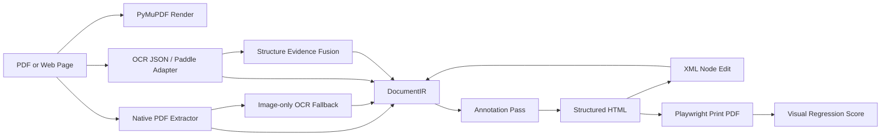

<p align="center">
  
</p>

<h1 align="center">Scriptorium PDF</h1>

<p align="center">
  <strong>把 PDF、网页打印 PDF 和 OCR 结构结果转换成可编辑、可标注、可回归评测的 HTML。</strong>
</p>

<p align="center">
  
  
  
  
</p>

## What It Does

Scriptorium PDF 是一个核心转换引擎，目标不是把 PDF 页面截图塞进 HTML，而是把 PDF 里的可识别结构转成可编辑节点：

- 从 PDF 提取 native text、字体、颜色、粗细、坐标、image block 和 drawing/shape。
- 对没有原生文字且页面主要由图像构成的扫描/截图 PDF，自动补 `native-ocr` 透明编辑锚点。
- 从 OCR / PaddleOCR-VL / PP-Structure 输出归一化到同一个 `DocumentIR`。
- 生成 `structured` HTML：文本节点可编辑，图形节点保留结构，DOM 上带识别标记。
- 支持 XML 级局部节点编辑，再回写到 IR 并重新导出 HTML/PDF。
- 用 Playwright 打印网页或 HTML 为 PDF，再用渲染图对比生成相似度指标。
- 用 benchmark 记录优化前后的可比较分数。

它适合做 PDF 编辑、翻译、版面重建、OCR 结构验证、HTML-PDF 转换质量评测的底层实验平台。

## Core Requirements

Scriptorium 的实现围绕四个硬需求设计：

| Requirement | Meaning |
|---|---|
| Structured output | 产出的 HTML 需要有文本、shape、role、bbox、style id、source marker，而不是单张整页截图。 |
| Local editability | 每个可编辑文本节点都有稳定 element id，可通过 DOM 或 XML 精确修改局部内容。 |
| Source preservation | OCR/native 原文保存在 `source_text`，编辑写入 `edited_text`，翻译写入 `translated_text`，不覆盖原始识别结果。 |
| Measurable quality | 每次转换都能打印回 PDF 并计算 `visual_similarity`、diff 分布、页数匹配和尺寸匹配，后续优化用同一指标比较。 |

## Why It Is Different

很多 PDF-to-HTML 工具会先渲染整页图片，然后把透明文本覆盖上去。那种方式视觉上容易接近，但局部编辑能力很弱。

Scriptorium 的 `structured` 模式明确避免整页图片：

```html
<div
  data-scriptorium-role="table-cell-text"
  data-scriptorium-source="native-pdf"
  data-scriptorium-style-id="style-004"
  data-scriptorium-layout-group="table-001"
  data-scriptorium-layout-kind="table"
  data-scriptorium-layout-confidence="0.86"
  data-scriptorium-semantic-order="12"
  data-scriptorium-column-count="2"
  data-scriptorium-reading-order-strategy="recursive-xy-cut-v1"
  data-scriptorium-reading-order-region="root/h1/v0"
  data-scriptorium-reading-order-scope="body"
  data-scriptorium-reading-order-sidebar=""
  data-scriptorium-reading-order-confidence="0.83"
  data-scriptorium-reading-order-evidence="recursive-xy-cut,horizontal-whitespace-cut,vertical-whitespace-cut"
  data-scriptorium-edit-target="edited_text"
  data-bbox-pdf="76.99,212.49,117.83,224.22"
  contenteditable="true"
>
  PDF text
</div>
```

每个节点都能追溯到来源、坐标、样式桶、版面分组和编辑目标。普通 drawing 会保留为 SVG line/path；复杂矢量图会在局部区域触发 raster fallback，仍然是带 bbox/source metadata 的局部 image 节点，不是整页背景图。

## Real-World Scores

<p align="center">
  
</p>

| Sample | Pages | Elements | Editable | Images | Shapes | Multi-Col | Visual Similarity | Max Diff | Mean Diff | Page/Size Match |
|---|---:|---:|---:|---:|---:|---:|---:|---:|---:|---|
| Hacker News live page printed by Playwright | 2 | 162 | 95 | 30 | 37 | 0 | 0.9800288 | 0.0199712 | 0.01032101 | yes / yes |
| arXiv paper: Attention Is All You Need | 15 | 876 | 761 | 6 | 109 | 163 | 0.96840246 | 0.03159754 | 0.02179977 | yes / yes |
| ACL paper: Transformer-XL | 11 | 1558 | 1446 | 2 | 110 | 1213 | 0.95679576 | 0.04320424 | 0.0365879 | yes / yes |
| Built-in benchmark fixtures, mean | 6 pages total | 72 | 53 | 0 | 19 | 20 | 0.9906702 | 0.01160961 | 0.00929831 | yes / yes |

`visual_similarity = 1 - max_diff_ratio`。`max_diff_ratio` 现在包含页数缺失和页面尺寸不匹配惩罚；报告会同时输出 `mean_diff_ratio`、`p95_diff_ratio`、`worst_page`、`page_count_match` 和 `dimension_match`，避免错误页面被 resize 后看起来“相似”。

Transformer-XL 这类 A4 变体页面曾受 Chromium 打印 1px 宽度量化影响；benchmark 现在会在打印后把导出 PDF 的 page box 归一到源页面尺寸，避免尺寸误差污染后续视觉指标。

内置 fixtures 同时带 `.semantic-order.json` ground truth。当前 `semantic_order_pair_accuracy = 1.0`，`semantic_sequence_similarity = 1.0`，覆盖 53 个期望文本节点；其中 20 个多栏文本节点由 `recursive-xy-cut-v1` 负责排序。arXiv Attention 论文有 repo 内部分人工 sidecar，覆盖 5 页、38 个关键文本点，`semantic_order_pair_accuracy = 1.0`。Transformer-XL 论文新增真实双栏 sidecar，覆盖 3 页、44 个关键文本点，`semantic_order_pair_accuracy = 1.0`。Hacker News 网页打印 PDF 覆盖 2 页、26 个关键文本点，`semantic_order_pair_accuracy = 1.0`。

最新 semantic benchmark 改进为网页打印 PDF 增加 parent-scoped sidecar，并把密集列表行桶从 12pt 收紧到 6pt，避免下一条列表编号插到上一条 metadata 前面。报告还输出 partial labels 忽略文本的 zone/role/source 分布：Attention 当前忽略 147 个未标注节点，Transformer-XL 忽略 277 个，web-HN 忽略 69 个 table-cell 节点，用于决定下一批人工 ground truth。Transformer-XL 的混合版面保护已放宽为“强重复栏锚点可越过表格 guard”，多栏覆盖从 880 增至 1213，阅读风险从 `0.17061801 / medium` 降到 `0.08879982 / low`。`column-flow-v1` 现在可以从重复左边界锚点识别最多三列文本流，并用短单元格宽度过滤避免把纯表格读成列。`spatial-graph-v1` 是更保守的弱列 fallback：当重复左边界聚类不足、页面又不像纯表格时，它用上下邻接和水平重叠关系串联列内链，并要求链覆盖率、列间距和垂直重叠同时达标。benchmark 现在还运行 column-biased `box-flow` 候选诊断，记录它与当前语义顺序的 pairwise disagreement，用来发现论文/复杂网页上是否存在值得模型或结构证据复核的替代顺序假设。`mixed-table-column-flow-v1` 进一步识别页面内部的局部表格岛：表格岛内部保持 row-major，周围正文仍可按多栏流排序，并通过 `reading_order_region_path = root/table-island-###` 标记；带重复 x-slot 的公式碎片会被排除，避免把论文公式读成表格。纯表格页现在会显式标为 `table-row-major-v1`，用 `table-row-major` / `table-grid-slots` 证据说明这是有意保留的行优先顺序，不再混入未知 `visual-yx` fallback。页边 running header/footer 现在会标记为 `reading_order_scope = page-artifact`，并从正文列聚类中剥离。页面印刷区外的窄边栏/旁注会标记为 `reading_order_scope = sidebar`、`reading_order_sidebar_type = left|right`，从正文列聚类中剥离并排在主叙事流之后。页底脚注会标记为 `reading_order_scope = footnote`，从正文列聚类中剥离，并在正文之后、边栏和页脚 artifact 之前进入语义顺序。视觉侧的主要瓶颈已经转向字体/浏览器重绘差异和正文行宽度拟合：`--text-fit auto` 会比较普通 HTML 文本和 bbox 内 SVG `textLength` 拟合层。它在论文类样本上选择 `0.99 + svg`，把 Attention 从 `0.93670278` 提升到 `0.96840246`，把 Transformer-XL 从 `0.93358709` 提升到 `0.95679576`；网页打印 PDF 自动保留 `none`，维持 `0.9800288`。

Reading-order 输出现在带有可解释证据和启发式置信度：`reading_order_confidence`、`reading_order_evidence`、`reading_order_evidence_summary` 会进入 IR、annotation 和 HTML `data-scriptorium-*` 属性。benchmark 同步汇总 `reading_order_mean_confidence`、`reading_order_low_confidence_element_count`、`table_row_major_element_count`、`spatial_graph_element_count`、`reading_order_box_flow_disagreement_ratio`、`reading_order_footnote_element_count`、`reading_order_sidebar_element_count` 和 `reading_order_evidence_counts`。内置 fixtures box-flow diagnostics 结果保持 `visual_similarity = 0.9906702`、`semantic_order_pair_accuracy = 1.0`，18 个表格文本节点标为 `table-row-major-v1`，平均 reading-order confidence 保持 `0.80113208`，风险保持 `0`，所有 fixture 都是 low risk。

`--html-mode fidelity` 是高保真 overlay 路径：HTML 可见层使用每页 SVG 或 raster 背景，识别出的文本/结构节点仍以透明 `contenteditable` 坐标锚点存在；未编辑时打印只输出背景层，已编辑或已翻译节点会作为局部白底 replacement layer 打印。`--html-mode auto --fidelity-background auto` 会同时比较 structured redraw、SVG fidelity 和 raster fidelity，并保留更高分候选：

| Sample | Best structured | SVG fidelity | Raster fidelity | Auto selected | Selected path |
|---|---:|---:|---:|---:|---|
| arXiv paper: Attention Is All You Need | 0.96840246 | 0.98809524 | 1.0 | 1.0 | `fidelity/raster` |
| ACL paper: Transformer-XL | 0.95679576 | 0.97636829 | 0.98096887 | 0.98096887 | `fidelity/raster` |
| Hacker News live page printed by Playwright | 0.9800288 | 0.99490923 | 1.0 | 1.0 | `fidelity/raster` |
| Three-sample mean | 0.96840901 | 0.98645759 | 0.99365629 | 0.99365629 | mixed |

Additional complex baselines now cover a public company annual report and an image-only ecommerce homepage screenshot:

| Sample | Source | Pages Scored | Selected Path | Visual Similarity | Elements | Editable | OCR Text | Mixed Table Flow | Page Artifacts | Footnotes | Sidebars | Images | Shapes | Semantic GT |
|---|---|---:|---|---:|---:|---:|---:|---:|---:|---:|---:|---:|---:|---|
| PUMA 2024 Annual Report | public annual report PDF | 12 / 345 | `fidelity/raster` | 0.9795117 | 815 | 521 | 0 | 238 | 20 | 2 | 36 | 15 | 279 | no |
| JD homepage full screenshot PDF | Playwright full-page screenshot | 1 / 1 | `fidelity/raster` | 0.99576887 | 135 | 134 | 134 | 0 | 0 | 0 | 0 | 1 | 0 | no |

JD is intentionally an image-only PDF. The visual score stayed effectively unchanged after OCR fallback, but the output now contains 134 editable `native-ocr` anchors while preserving the original screenshot as the visible layer. PUMA keeps 0 OCR fallback pages because its sampled pages already contain native PDF text. Its latest reading-order diagnostics are better without changing the pixel score: `mixed-table-column-flow-v1` handles 238 elements, 20 running-header candidates are marked as page artifacts, 36 right-side sidebar/marginalia elements and 2 bottom-zone footnote elements are routed as secondary flow, table-like pages dominated by visual order drop to 0, and risk is now `0.35 / high`.

Current box-flow diagnostics spot checks:

| Sample | Visual Similarity | Semantic Order | Reading Risk | RO Confidence | Box-Flow Disagreement | Spatial Graph | Table Row-Major | Footnotes | Sidebars | Evidence Highlights |
|---|---:|---:|---|---:|---:|---:|---:|---:|---:|---|
| Built-in fixtures | 0.9906702 | 1.0 | `5 low` | 0.80113208 | 0.19494585 | 0 | 18 | 0 | 0 | `table-row-major`, `recursive-xy-cut`, whitespace cuts |
| Transformer-XL first 3 pages | 0.98160664 | 1.0 | `0.21573209 / medium` | 0.9552648 | 0.0825672 | 0 | 0 | 7 | 0 | `column-flow`, `repeated-left-edge`, `footnote-secondary-flow` |
| PUMA 2024 Annual Report first 12 pages | 0.9795117 | n/a | `0.35 / high` | 0.82476488 | 0.17460108 | 0 | 0 | 2 | 36 right | `sidebar-secondary-flow`, `footnote-secondary-flow`, `table-island-row-major` |
| JD homepage screenshot PDF | 0.99576887 | n/a | `0.35 / high` | 0.83 | 0.42778588 | 0 | 0 | 0 | 0 | `recursive-xy-cut`, OCR coordinate anchors |

The current public benchmark set does not trigger `spatial-graph-v1`; stronger existing paths cover these pages first. The fallback is covered by a dedicated weak-column unit test, and `spatial_graph_element_count` is now reported so future PDFs can show whether this path is carrying real pages.
Box-flow disagreement is a diagnostic, not a correctness score. A high value means the column-biased candidate order differs from the current semantic order; it is useful for choosing pages that need semantic labels, model evidence, or manual review.

<p align="center">
  
</p>

## Requirements

Required:

- Python `3.10+`
- Google Chrome / Chromium
- Playwright Python package
- PyMuPDF
- Pillow
- Pydantic
- Jinja2
- Typer

Optional:

- PaddleOCR / PaddleOCR-VL for local OCR and document structure experiments
- Tesseract OCR binary and language data for PyMuPDF image-only OCR fallback, for example `eng` and `chi_sim`

Notes:

- `.env.example` is committed as a template.
- `.env`, `.venv/`, `data/`, and `outputs/` are intentionally ignored.
- Playwright is launched with `--no-proxy-server` by default in this repo because some environments inject proxy credentials into Chrome.

## Installation

```bash
python3 -m venv .venv
. .venv/bin/activate
pip install -r requirements.txt
pip install -e .
```

Optional OCR stack:

```bash
pip install -r requirements-ocr.txt
```

Image-only OCR fallback uses PyMuPDF's Tesseract bridge, so it also needs the system `tesseract` command and installed language data. If Tesseract is unavailable, `--ocr-fallback off` keeps conversion deterministic and benchmark reports still expose textless/image-only pages.

## Quick Start

Generate a deterministic PDF fixture:

```bash
scriptorium make-fixture --out-dir data/fixture
```

Convert it to IR:

```bash
scriptorium convert \
  data/fixture/sample.pdf \
  --ocr-json data/fixture/sample.ocr.json \
  --out-dir outputs/sample
```

External structure evidence from PaddleOCR-VL / PP-StructureV3 style JSON can be fused without making the model runtime a core dependency:

```bash
scriptorium convert \
  path/to/input.pdf \
  --structure-json path/to/paddle-or-ppstructure.json \
  --out-dir outputs/with-structure
```

Export HTML:

```bash
scriptorium export-html \
  outputs/sample/document.ir.json \
  --out-dir outputs/sample/html \
  --display-mode structured
```

Print HTML back to PDF and compare:

```bash
scriptorium print-pdf \
  outputs/sample/html/index.html \
  --pdf outputs/sample/export.pdf

scriptorium compare-pdf \
  data/fixture/sample.pdf \
  outputs/sample/export.pdf \
  --out-dir outputs/sample/pdf-quality
```

## Real Web Page Workflow

Capture a live page with Playwright:

```bash
scriptorium capture-pdf \
  https://news.ycombinator.com/ \
  --pdf outputs/external/web-hn/input.pdf \
  --mode print
```

Convert the captured PDF into annotated structured HTML:

```bash
scriptorium convert \
  outputs/external/web-hn/input.pdf \
  --out-dir outputs/external/web-hn/structured \
  --extract-mode native \
  --dpi 144

scriptorium export-html \
  outputs/external/web-hn/structured/document.ir.json \
  --out-dir outputs/external/web-hn/structured/html \
  --display-mode structured
```

Score the result:

```bash
scriptorium print-pdf \
  outputs/external/web-hn/structured/html/index.html \
  --pdf outputs/external/web-hn/structured/structured-export.pdf

scriptorium compare-pdf \
  outputs/external/web-hn/input.pdf \
  outputs/external/web-hn/structured/structured-export.pdf \
  --out-dir outputs/external/web-hn/structured/pdf-quality \
  --dpi 144
```

## Benchmark

Run the built-in multi-PDF benchmark:

```bash
scriptorium benchmark --out-dir outputs/benchmark-baseline --dpi 192
```

Run benchmark on your own PDFs:

```bash
scriptorium benchmark path/to/file1.pdf path/to/file2.pdf --out-dir outputs/my-benchmark --dpi 144
```

For very large external documents, score a stable front-matter sample:

```bash
scriptorium benchmark path/to/annual-report.pdf \
  --max-pages 12 \
  --html-mode auto \
  --fidelity-background auto \
  --out-dir outputs/annual-report-benchmark \
  --dpi 144
```

Try the local URW/DejaVu font fallback profile as an A/B experiment:

```bash
scriptorium benchmark path/to/paper.pdf \
  --font-profile local-urw \
  --out-dir outputs/font-profile-local-urw \
  --dpi 144
```

Run a benchmark-time font calibration sweep and keep the better per-PDF result:

```bash
scriptorium benchmark path/to/paper.pdf \
  --font-profile auto \
  --out-dir outputs/font-profile-auto \
  --dpi 144
```

`auto` runs both `browser-default` and `local-urw` candidates, writes both candidate artifacts under the case directory, and selects the higher `visual_similarity` result for the report. In the current real-sample sweep, it selected `local-urw` for Attention (`0.93202666 -> 0.93871982`) and kept `browser-default` for Transformer-XL (`0.93358709`) and Hacker News (`0.9800288`).

Run a lightweight font-size calibration sweep:

```bash
scriptorium benchmark path/to/paper.pdf \
  --font-size-scale auto \
  --out-dir outputs/font-size-scale-auto \
  --dpi 144
```

`--font-size-scale auto` evaluates `0.99` and `1.0`, records candidate artifacts, and selects the higher score. It improved the Attention sample with `browser-default` from `0.93202666` to `0.93670278`, while keeping Transformer-XL and Hacker News at `1.0`.

Run a structured text-fit sweep:

```bash
scriptorium benchmark path/to/paper.pdf \
  --text-fit auto \
  --out-dir outputs/text-fit-auto \
  --dpi 144
```

`--text-fit auto` evaluates the normal editable HTML text layer and an SVG fitted text layer. The SVG candidate uses each PDF text bbox/run bbox plus `textLength` / `lengthAdjust="spacingAndGlyphs"` to match line width while keeping a transparent editable proxy in the DOM. Combined with `--font-size-scale auto`, it raised the current structured paper scores to Attention `0.96840246` and Transformer-XL `0.95679576`; Hacker News selected `none` because its normal HTML text remains closer.

Run an HTML-mode sweep for complex pages:

```bash
scriptorium benchmark path/to/paper.pdf \
  --html-mode auto \
  --fidelity-background auto \
  --font-size-scale auto \
  --text-fit auto \
  --out-dir outputs/html-mode-auto \
  --dpi 144
```

`--html-mode auto` benchmarks structured redraw plus fidelity overlay candidates, and `--fidelity-background auto` lets fidelity mode choose SVG or raster page backgrounds by score. The selected fidelity candidate still carries editable/annotated coordinate nodes in the HTML; unchanged nodes are hidden on print and edited/translated nodes print as replacement overlays.

You can combine both calibration axes:

```bash
scriptorium benchmark path/to/paper.pdf \
  --font-profile auto \
  --font-size-scale auto \
  --text-fit auto \
  --out-dir outputs/visual-calibration-auto \
  --dpi 144
```

Run the high-fidelity overlay benchmark:

```bash
scriptorium benchmark path/to/paper.pdf \
  --html-mode fidelity \
  --fidelity-background auto \
  --out-dir outputs/fidelity-overlay \
  --dpi 144
```

This mode keeps editable coordinate nodes in the HTML but hides them during print, so the score measures source visual preservation. SVG backgrounds stay vector and zoom-friendly; raster backgrounds often produce stricter pixel parity for complex pages. Use this mode to track the future edit-mask/replacement architecture separately from the fully structured redraw path.

Image-only OCR fallback is enabled by default for native extraction and only triggers when a page has no native text and high image coverage:

```bash
scriptorium benchmark path/to/scanned-or-screenshot.pdf \
  --ocr-fallback image-only \
  --ocr-language eng+chi_sim \
  --ocr-dpi 144 \
  --html-mode auto \
  --fidelity-background auto \
  --out-dir outputs/image-only-ocr \
  --dpi 144
```

Use `--ocr-fallback off` to measure visual source preservation without adding OCR text anchors.

Run the same benchmark with external PaddleOCR-VL / PP-StructureV3 style evidence:

```bash
scriptorium benchmark \
  path/to/file1.pdf path/to/file2.pdf \
  --structure-json path/to/file1.structure.json \
  --structure-json path/to/file2.structure.json \
  --out-dir outputs/native-plus-structure \
  --dpi 144
```

For a single PDF, pass one `--structure-json`. For multiple PDFs, pass JSON files in PDF order or name them like `<pdf-stem>.structure.json` / `<parent-dir>.<pdf-stem>.structure.json` so the benchmark can match them.

Outputs:

- `benchmark_report.json`: full metrics, per-stage timings, artifact paths
- `benchmark_summary.csv`: compact table for tracking optimization progress
- per-case `document.ir.json`, `html/index.html`, exported PDF (`structured-export.pdf` or `fidelity-*-export.pdf`), and visual diff images

Tracked metrics:

- `visual_similarity`
- `max_diff_ratio`
- `mean_diff_ratio`
- `p95_diff_ratio`
- `worst_page`
- page count match
- page dimension match
- max pages limit when `--max-pages` is used
- image count
- multi-column element count
- column-flow element count
- mixed table/column-flow element count
- table row-major element count
- spatial graph element count
- recursive XY-Cut element count
- reading-order page artifact count
- reading-order footnote element count
- reading-order sidebar element count
- reading-order strategy counts
- reading-order mean confidence, low-confidence element count, and evidence counts
- reading-order box-flow candidate pair count, disagreement pair count, disagreement page count, and disagreement ratio
- reading-order risk score, risk level, text-flow column geometry, repeated-anchor columns, table-like page count, and unlabeled-text risk count
- font profile
- font profile candidate scores when `--font-profile auto` is used
- font size scale and candidate scores when `--font-size-scale auto` is used
- text fit strategy and candidate scores when `--text-fit auto` is used
- HTML mode and vector background page count
- fidelity background strategy and candidate scores when `--fidelity-background auto` is used
- raster policy
- text run count
- mixed inline style element count
- layout region counts
- raster fallback count and rasterized text/image/shape counts
- OCR fallback policy, applied page count, OCR text count, image-only candidate pages, and textless page count
- structure evidence source, region count, matched element count, and reordered page count
- semantic ground-truth case count
- semantic order pair accuracy
- semantic sequence similarity
- semantic ignored text count for partial labels
- semantic ignored text zone/role/source counts for partial labels
- semantic missing/extra text count
- `total_seconds`
- stage timings: render, extraction/annotation, HTML export, PDF print, visual comparison, semantic comparison
- element count
- editable element count
- shape count
- style count
- annotation count

## Architecture



Core files:

- `src/scriptorium/models.py`: `DocumentIR`, page and element models
- `src/scriptorium/native_pdf.py`: native text and drawing extraction
- `src/scriptorium/annotations.py`: role/style/source/bbox annotation pass
- `src/scriptorium/reading_order.py`: visual order, recursive XY-Cut, column-flow, spatial graph, box-flow candidates, table row-major, table-island, artifact, sidebar, and footnote semantic order
- `src/scriptorium/structure_evidence.py`: PaddleOCR-VL/PP-Structure style external region/order evidence fusion
- `src/scriptorium/html_export.py`: standalone HTML export
- `src/scriptorium/xml_edit.py`: XML node edit round trip
- `src/scriptorium/benchmark.py`: reproducible quality benchmark
- `docs/optimization-roadmap.md`: reading-order and complex-page optimization plan
- `docs/external-benchmarks.md`: reproducible external source list and current sample scores

## Data Model

`DocumentIR` is the source of truth. It keeps:

- page size in PDF points and rendered pixels
- element bbox in PDF points and pixels
- `source_text`, `edited_text`, `translated_text`
- `text_runs` for native PDF inline spans: text, bbox, font, weight, style, color, script, and run style id
- `font_profile`: the CSS font fallback profile used during native PDF extraction
- native drawing SVG evidence: simple line points and non-rectangular path data
- native image/raster crops via `source_crop`
- `semantic_order`, `visual_order`, `column_index`, `column_count`, `flow_segment_index`, `reading_order_strategy`, `reading_order_region_path`, `reading_order_scope`, `reading_order_artifact_type`, and `reading_order_sidebar_type`
- `reading_order_confidence`, `reading_order_evidence`, and `reading_order_evidence_summary` for explaining why a node was ordered by visual y/x, XY-Cut, column flow, spatial graph, table row-major, table-island flow, page artifact detection, footnote/sidebar secondary flow, or external structure evidence
- optional external structure evidence such as `external_structure_label`, `external_structure_order`, and fused region metadata
- source kind: `native-pdf`, `native-ocr`, `native-image`, `native-raster-region`, `native-drawing`, external OCR fallback, etc.
- role: `heading`, `paragraph`, `table-cell-text`, `table-shape`, `figure-shape`, `separator-shape`, etc.
- style bucket: `style-001`, `style-002`, ...
- layout group: for example `table-001`, `figure-001`, `separator-001`
- layout region metadata: region kind, bbox, confidence, and contributing shape ids
- revision history for edits and translation

The original `source_text` is never overwritten. Inline runs are used when rendering source text; once an element has `edited_text` or `translated_text`, Scriptorium renders the replacement as plain editable text instead of forcing old source runs onto new content.

## OCR And Structure Strategy

The default tested path uses native PDF extraction or JSON fallback. Heavy model runtimes remain optional, but their structured output can now assist the core pipeline:

- conversion, annotation, HTML export, XML edit, and benchmark do not depend on the model runtime
- `--font-profile browser-default` is the stable default; `--font-profile local-urw` can be benchmarked when local Nimbus/DejaVu fonts are available
- `scriptorium benchmark --font-profile auto` performs a reproducible two-profile sweep and records the selected profile plus both candidate scores
- `scriptorium benchmark --font-size-scale auto` performs a small font-size sweep and records the selected scale plus candidate scores
- `scriptorium benchmark --text-fit auto` compares normal editable HTML text against an SVG fitted text layer plus editable proxy, then records the selected candidate
- `scriptorium benchmark --html-mode fidelity` benchmarks the editable overlay path for source-preservation quality and supports SVG/raster page backgrounds plus edited/translated replacement overlays
- `scriptorium benchmark --html-mode auto --fidelity-background auto` compares structured redraw, SVG fidelity, and raster fidelity candidates, then records the selected visual path
- `scriptorium benchmark --max-pages N` limits each input to the first N pages, useful for large annual reports and manuals while keeping the source PDF intact
- `--ocr-fallback image-only` is the default native fallback for scanned/screenshot PDFs: pages with no native text and high image coverage get transparent `native-ocr` edit anchors while the original image remains the visual layer
- `--ocr-language` and `--ocr-dpi` control the local Tesseract/PyMuPDF OCR pass; benchmark reports include `ocr_fallback_applied_page_count`, `ocr_text_count`, `image_only_candidate_page_count`, and `textless_page_count`
- `--raster-policy dense` is the stable native fallback; `--raster-policy tables` is available as an explicit experiment, but current real-paper/web A/B results did not justify making table-region rasterization the default
- `--structure-json` accepts PaddleOCR-VL / PP-StructureV3 style JSON with region bbox, label, content, and block order
- `structure_evidence.py` aligns those regions back to native elements by bbox coverage/text similarity
- matched elements can receive external role/order metadata and `external-structure-fusion-v1` reading-order strategy
- `scriptorium benchmark --structure-json ...` reports whether those regions matched elements or changed page order, enabling native-only versus native-plus-structure A/B runs
- `requirements-ocr.txt` keeps heavyweight OCR dependencies optional

## Development

Run tests:

```bash
pytest
```

Current local test baseline:

```text
61 passed
```

## Project Status

This is a core-first prototype. It already has real PDF and real webpage benchmarks, stricter visual metrics, v2 layout grouping, native PDF span-level inline style preservation, PDF line-width alignment for structured text, SVG text-fit calibration with editable proxies, gated script-run positioning, native drawing SVG path output, fidelity SVG/raster overlay with edited/translated replacement printing, native image extraction, image-only OCR fallback, local raster fallback for dense vector regions, benchmark-time font profile/font-size/text-fit/background calibration, benchmark page limiting for large reports, recursive XY-Cut semantic order for sectioned multi-column pages, repeated-anchor two/three-column flow detection with table guard protection, spatial-graph weak-column fallback, box-flow candidate disagreement diagnostics, local table-island segmentation for mixed table/body pages, page-artifact tagging, sidebar/marginalia secondary-flow routing, per-element reading-order confidence/evidence metadata, table-vs-column reading-order diagnostics, Paddle/PP-Structure style external evidence fusion, real-paper partial semantic ground truth, and strategy coverage metrics. The next useful work is running real model outputs through the fusion path, broader real-document semantic ground truth, richer OCR adapter mapping, and more precise edit-aware masks/reflow while keeping benchmark scores comparable.
