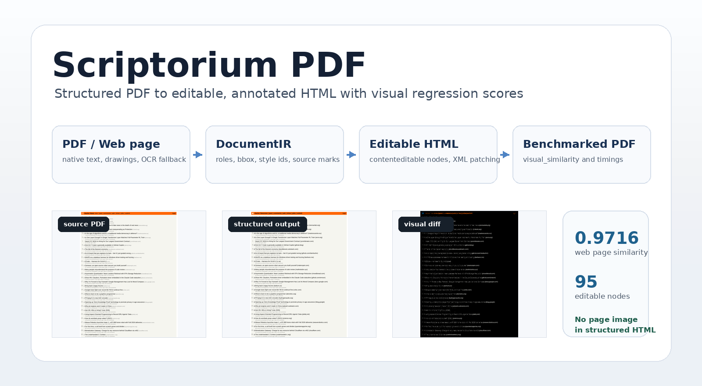
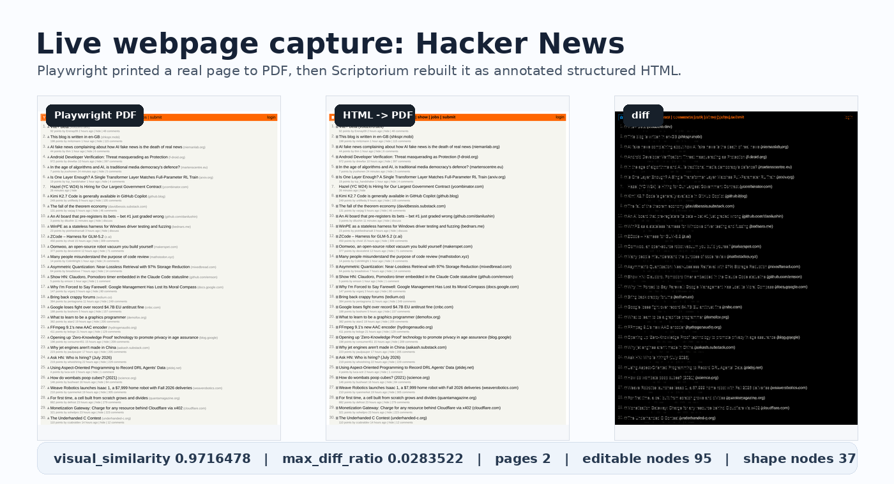
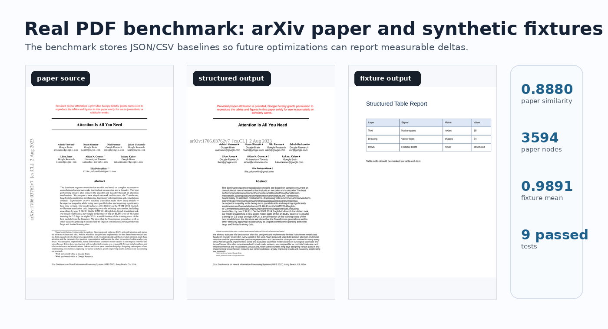
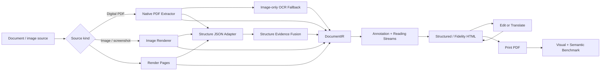

<p align="center">
  
</p>

<h1 align="center">Scriptorium</h1>

<p align="center">
  <strong>把文档源转换成可编辑、可标注、可评测的 HTML，并保留足够的结构证据用于翻译和回渲染。</strong>
</p>

<p align="center">
  <a href="README.zh-CN.md"></a>
  <a href="README.en.md"></a>
</p>

<p align="center">
  
  
  
  
</p>

<p align="center">
  <a href="#快速开始">快速开始</a>
  ·
  <a href="#核心流程">核心流程</a>
  ·
  <a href="#benchmark">Benchmark</a>
  ·
  <a href="https://followcat.github.io/Scriptorium/">在线展示页</a>
  ·
  <a href="#文档">文档</a>
</p>

Scriptorium 是一个 source-neutral 的文档到 HTML 转换与评测引擎。当前主路径覆盖 PNG/JPEG/TIFF/WebP 图片、网页截图、PDF、网页打印 PDF 和 image-only PDF；图片源会作为一等 source 进入 IR，而不是先伪装成 PDF。

它会把源文档的文本、图像、矢量形状、OCR 结果和外部结构 JSON 合并到一个 `DocumentIR`，再导出带坐标和结构标记的 HTML。每个可编辑节点都保留来源、bbox、样式、role、reading stream 和编辑/翻译字段，后续可以写回 `edited_text` 或 `translated_text`，再打印或转换回 PDF。

## 适合什么场景

| 场景 | Scriptorium 提供什么 |
|---|---|
| 文档编辑实验 | 把局部文本节点变成可定位、可替换、可回写的 HTML 元素。 |
| 文档翻译回渲染 | 保留源视觉层，翻译写入 `translated_text`，用浏览器实测 fitting，并检测 replacement mask、overflow 和邻近冲突。 |
| 论文/年报/门户页结构分析 | 识别多栏正文、表格岛、卡片网格、脚注、边栏、页眉页脚和局部 reading streams。 |
| OCR/版面模型验证 | 接入 PaddleOCR-VL、PP-Structure、Docling、ROOR 风格结构 JSON，让 OCR/结构 JSON 主导 image source 的语义层，并做 native-only 与 native-plus-structure A/B benchmark。 |
| 转换质量回归 | HTML 打印回 PDF 后，输出视觉相似度、页面尺寸/页数匹配、语义顺序和风险指标。 |

## 为什么不是只用截图

很多 PDF-to-HTML / OCR-to-HTML 工具会把整页渲染成背景图，再覆盖一层透明文本。这样视觉上容易接近，但局部编辑、翻译、阅读顺序和结构标注都很弱。

Scriptorium 支持两条路径：

- `structured`：尽量用 HTML/SVG 重建文本、图像和形状，便于检查结构和可编辑性。
- `fidelity`：保留 SVG/raster 源视觉层，同时把识别出的文本和结构节点作为透明坐标锚点；编辑或翻译后，只对变更节点生成经浏览器 fitting 的局部 replacement overlay。

输出 HTML 中的节点会带上 `data-scriptorium-*` 元数据，例如 role、source、bbox、style id、reading order、reading stream、translation target 和 replacement risk。完整字段说明见 [实现说明](docs/implementation-notes.zh-CN.md)。

独立 HTML 内置 `window.ScriptoriumEdits`：浏览器内的局部修改会生成可校验的 `scriptorium-html-edits/v1` 补丁，可通过 `scriptorium apply-html-edits` 写回同一份 `DocumentIR` 后再导出或打印。

<table>
  <tr>
    <td width="50%">
      <br>
      <strong>网页 / 门户页 source</strong><br>
      用 Playwright 打印 PDF 或截图，再转换成带 OCR/native 坐标锚点的 HTML。
    </td>
    <td width="50%">
      <br>
      <strong>论文 / 年报 / 手册</strong><br>
      用相同 benchmark 追踪不同 source 的视觉、语义顺序、候选分歧和翻译回渲染风险。
    </td>
  </tr>
</table>

<p align="center">
  <a href="https://followcat.github.io/Scriptorium/"><strong>打开真实 source 与 HTML 的左右对照展示页</strong></a>
</p>

## 快速开始

```bash
python3 -m venv .venv
. .venv/bin/activate
pip install -r requirements.txt
pip install -e .
```

图片、截图或扫描页可以直接作为 source 输入。已有 OCR/结构 JSON 时，它会先生成文本锚点，再用结构证据补 role、reading order 和 reading streams：

```bash
scriptorium convert \
  path/to/page.png \
  --input-kind image \
  --structure-json path/to/page.structure.json \
  --out-dir outputs/image-source

scriptorium export-html \
  outputs/image-source/document.ir.json \
  --out-dir outputs/image-source/html \
  --display-mode fidelity
```

保存的 PaddleOCR-VL JSON 会保留模型输入画布尺寸。Scriptorium 会通过其中的
`width`/`height` 映射像素 bbox，因此同一次模型运行可以安全地在不同转换或
benchmark DPI 下重放。

当模型给出显式 `block_order` 的正文/段落 block，且匹配到的 native 行全部位于同一
已选 flow segment 和列中时，Scriptorium 会把它们提升为 `external-block-body-*`
本地翻译流。这个边界不会重排页面，也不会跨越 table、grid、caption、页眉页脚、
脚注或边栏；它用于让翻译和编辑按真实段落分批处理，而不是把 model block 当成全页
阅读顺序。

也可以用内置 PDF fixture 快速跑通完整链路：

```bash
scriptorium make-fixture --out-dir data/fixture

scriptorium convert \
  data/fixture/sample.pdf \
  --ocr-json data/fixture/sample.ocr.json \
  --out-dir outputs/sample

scriptorium export-html \
  outputs/sample/document.ir.json \
  --out-dir outputs/sample/html \
  --display-mode structured
```

打印回 PDF 并评分：

```bash
scriptorium print-pdf \
  outputs/sample/html/index.html \
  --pdf outputs/sample/export.pdf

scriptorium compare-pdf \
  data/fixture/sample.pdf \
  outputs/sample/export.pdf \
  --out-dir outputs/sample/pdf-quality
```

外部 OCR/结构模型不是核心依赖。没有 OCR/结构 JSON 时，image source 仍会得到整页图片 visual layer；有 OCR 或 Paddle/PP-Structure/Docling/ROOR 风格结构 JSON 时，会生成透明文本锚点和 reading-stream 证据。

可选 OCR 依赖放在 `requirements-ocr.txt`。Image-only OCR fallback 依赖系统 `tesseract` 和对应语言数据；本地运行 PP-StructureV3 时，还需要按 [实现说明](docs/implementation-notes.zh-CN.md#外部结构证据融合) 设置对应 Paddle CPU 兼容环境变量。

## 核心流程



主要模块：

| 模块 | 作用 |
|---|---|
| `native_pdf.py` | 提取 native 文本、图像、drawing 和页面几何。 |
| `structure_evidence.py` | 归一化 PaddleOCR-VL / PP-Structure / Docling / ROOR 风格的结构证据。 |
| `ocr.py` | 把 OCR/结构 JSON 归一为 image/source text anchors，并记录语义层来源；对 image source，结构 JSON 可以是 semantic driver。 |
| `reading_order.py` | 处理多栏、表格岛、卡片网格、脚注、边栏、caption 和 reading streams。 |
| `html_export.py` | 导出 structured/fidelity HTML，保留编辑和翻译锚点。 |
| `benchmark.py` | 运行视觉、语义顺序、结构 A/B 和翻译回渲染 benchmark。 |

## Benchmark

运行内置 benchmark：

```bash
scriptorium benchmark --out-dir outputs/benchmark-baseline --dpi 192
```

对外部文档运行高保真路径选择：

```bash
scriptorium benchmark path/to/file.pdf \
  --out-dir outputs/my-benchmark \
  --dpi 144 \
  --html-mode auto \
  --fidelity-background auto
```

对比 native-only 与外部结构证据：

```bash
scriptorium benchmark-structure-ab \
  path/to/source.pdf \
  --structure-json path/to/source.structure.json \
  --out-dir outputs/structure-ab \
  --dpi 144
```

压测翻译回渲染：

```bash
scriptorium benchmark path/to/file.pdf \
  --html-mode fidelity \
  --fidelity-background auto \
  --translation-stress pseudo-expand \
  --out-dir outputs/translation-stress \
  --dpi 144
```

图片源也可以直接 benchmark。视觉评分会比较源图片 visual layer 与 HTML 打印 PDF 的渲染结果；结构 JSON 会先生成 OCR/text anchors，再参与 reading-stream 和结构证据融合，并在报告中写入 `semantic_layer_driver`：

```bash
scriptorium benchmark path/to/page.png \
  --input-kind image \
  --image-dpi 96 \
  --structure-json path/to/page.structure.json \
  --html-mode structured \
  --out-dir outputs/image-benchmark
```

代表性样本的当前结果如下。详细命令、样本来源、checksum 和完整指标见 [外部基准](docs/external-benchmarks.zh-CN.md)。

| 样本 | 页数 | 主要压力 | Visual similarity | 备注 |
|---|---:|---|---:|---|
| Hacker News 打印 PDF | 2 | 真实门户/列表页 | 0.9800288 | 有 semantic sidecar。 |
| Attention Is All You Need | 15 | 论文多栏和公式/图表 | 0.96840246 | 用于论文阅读顺序回归。 |
| Transformer-XL | 11 | 双栏论文和复杂页面尺寸 | 0.95679576 | 用于多栏 successor edge 验证。 |
| BYD 2024 年报 | 40 | 中文年报、表格、密集线框 | 0.89780001 | 当前中文复杂 PDF 压力样本。 |
| JD 首页截图 PDF | 1 | Image-only 电商首页 | 0.99576887 | 通过 OCR 生成透明编辑锚点。 |
| JD 首页截图 PNG | 1 | 一等 image source 路径 | 0.99236799 | 与 image-only PDF 兼容路径产生同规模 OCR/结构锚点。 |

`visual_similarity = 1 - max_diff_ratio`。报告同时记录页数/尺寸匹配、diff 分布、reading-order risk、candidate disagreement、grid/table/stream 统计和 replacement 风险。

## 编辑和翻译

`source_text` 永远保留原始识别结果。局部编辑写入 `edited_text`，翻译写入 `translated_text`。fidelity 模式会在打印时隐藏未修改节点，只为编辑或翻译后的节点生成局部、与源背景相容的 replacement layer。

翻译回渲染目前重点解决三类问题：

- 长译文如何在原 bbox 内 fit。Chromium 会在字体加载后实测字形排版，搜索受限缩放，并在确有收益时压缩行高；静态 estimate 与实际 clipping 会分开记录，前者只用于 fallback 和 triage。
- replacement mask 如何覆盖源文本但不破坏邻近元素。每个方向的 mask 都会在相邻可见元素处停止；亮色源文本落在深色 raster 边缘时会采样深色 mask，而不是固定白底。打印时还会把 source render pixel 映射到 96-DPI CSS 坐标，保证 replacement box、padding 和字号在导出 PDF 中不偏移。
- 多栏、表格岛、卡片网格和边栏如何作为独立 reading stream 分批翻译。

这部分还不是完整的交互式文档编辑器。当前更像一个可测量的转换内核：它把风险显式标出来，让后续 UI、人工复核或模型结构证据有稳定的数据入口。

## 当前边界

- 复杂页面的视觉还原可以靠 fidelity 背景层做得很接近；真正困难的是语义顺序、局部流结构和翻译后 replacement 冲突。
- 没有结构先验时，门户页、商品网格、公告表格和扫描 OCR 页面的阅读顺序可能存在合理歧义。
- PaddleOCR-VL / PP-Structure / Docling 结构 JSON 已可作为 evidence 融合，但模型运行时保持可选。
- 项目仍是 research prototype，适合做转换、评测和架构实验，不是面向终端用户的桌面文档编辑器。

## 文档

- [English README](README.en.md)
- [默认中文 README](README.md)
- [实现说明](docs/implementation-notes.zh-CN.md)
- [优化路线](docs/optimization-roadmap.zh-CN.md)
- [外部基准](docs/external-benchmarks.zh-CN.md)
- [Implementation notes](docs/implementation-notes.md)
- [Optimization roadmap](docs/optimization-roadmap.md)
- [External benchmarks](docs/external-benchmarks.md)

## 开发

```bash
pytest
```
