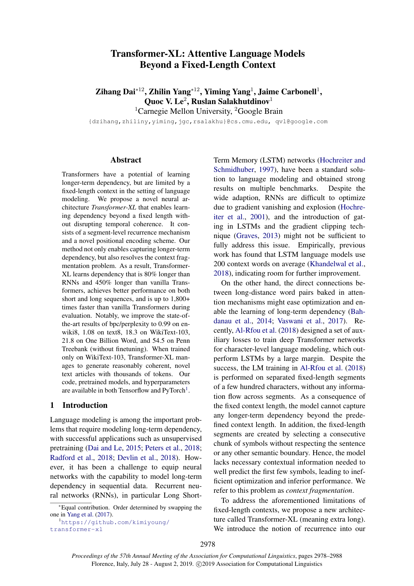
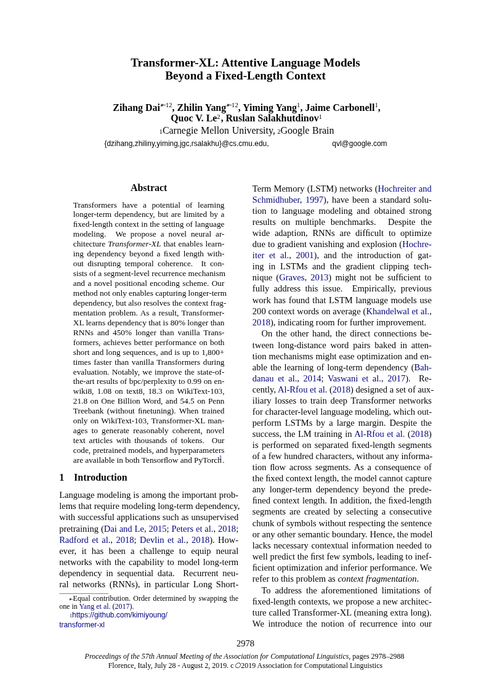
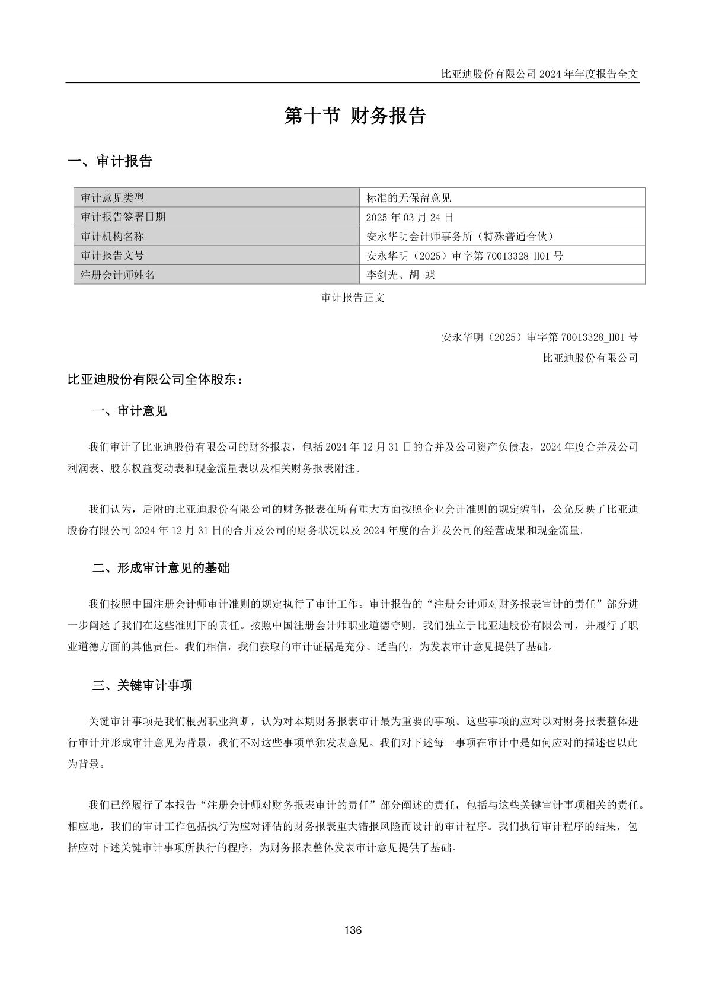
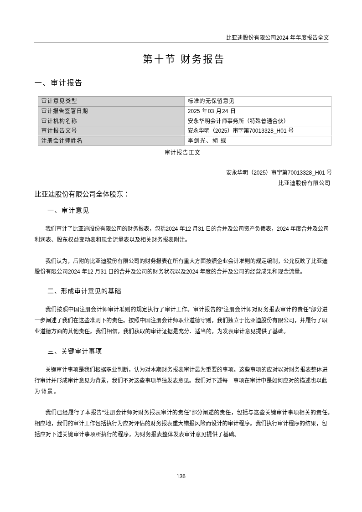
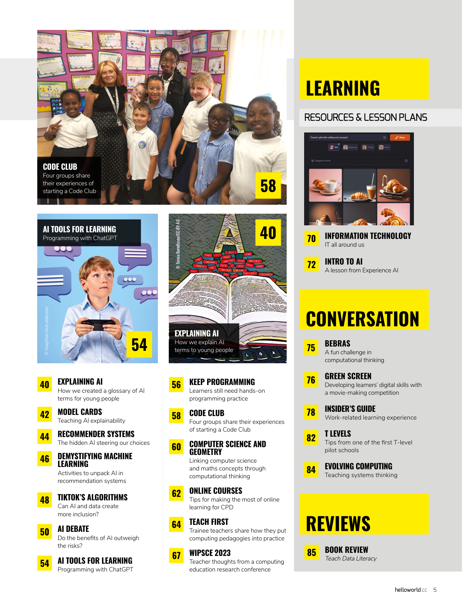
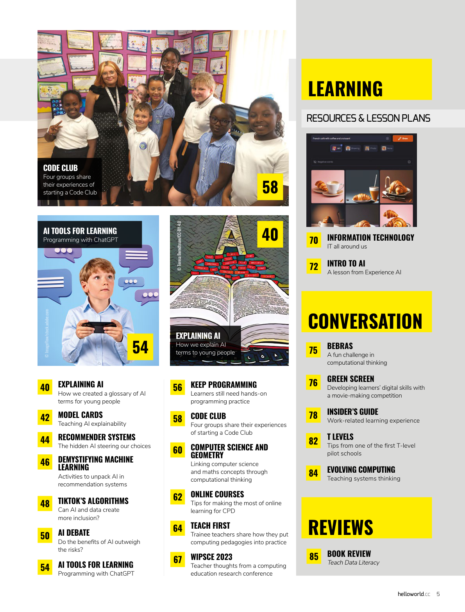
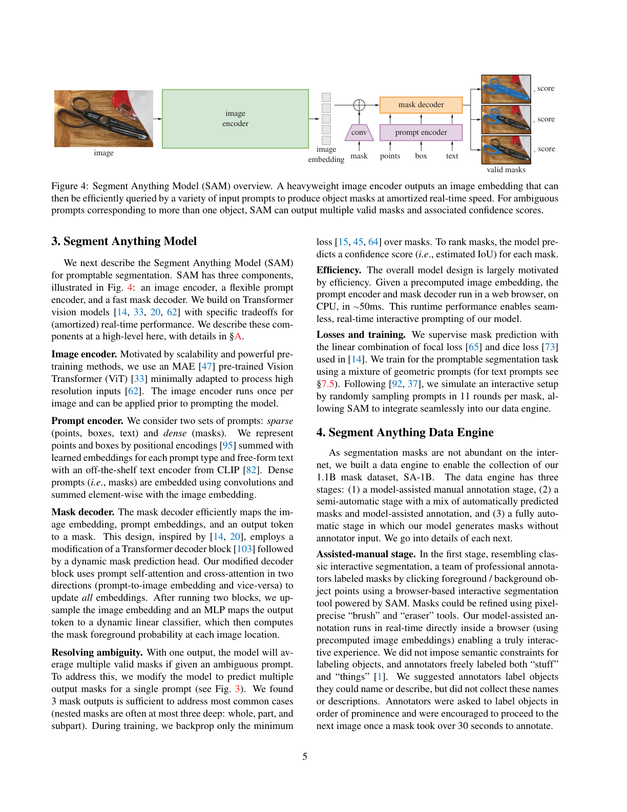
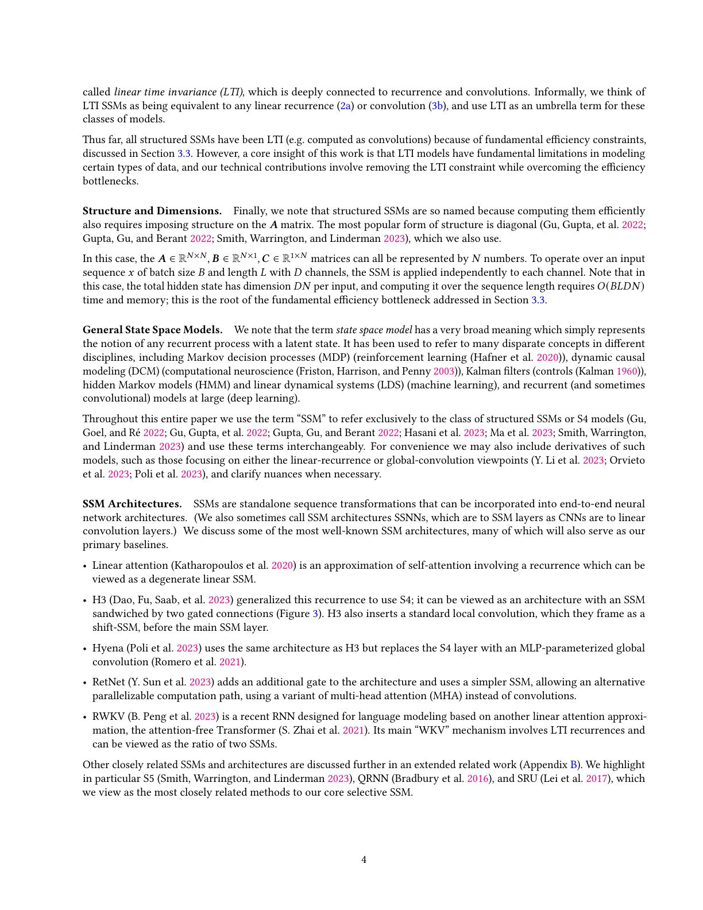

# Scriptorium Conversion Gallery

  
  

Open the [interactive gallery](https://followcat.github.io/Scriptorium/) to
inspect the generated HTML as a live DOM. This page is the GitHub-native
fallback: the left side is a tracked source page, and the right side is a fresh
Chromium screenshot of the generated HTML in this repository.

The standalone interactive bundle remains at [`index.html`](index.html). A
workflow run also publishes the complete `scriptorium-showcase` artifact and
deploys the same bundle to GitHub Pages.

## Multi-column paper

Transformer-XL page 1 tests title hierarchy, two-column body flow, equations,
footnotes, and local semantic successor order.

<table>
  <tr>
    <th width="50%">Source PDF page</th>
    <th width="50%">Generated structured HTML</th>
  </tr>
  <tr>
    <td></td>
    <td></td>
  </tr>
</table>

## Financial report

BYD annual report page 136 tests Chinese type, dense vector rules, table cells,
and translation-local table streams. The full source report is available from
[CNINFO](https://static.cninfo.com.cn/finalpage/2025-03-25/1222881496.PDF).

<table>
  <tr>
    <th width="50%">Source PDF page</th>
    <th width="50%">Generated structured HTML</th>
  </tr>
  <tr>
    <td></td>
    <td></td>
  </tr>
</table>

## Image source

The JD homepage screenshot enters Scriptorium as a first-class image source.
The fidelity HTML preserves the visual layer while exposing 141 OCR anchors and
four local reading streams for editing and translation experiments.

<table>
  <tr>
    <th width="50%">Source image</th>
    <th width="50%">Generated fidelity HTML</th>
  </tr>
  <tr>
    <td></td>
    <td></td>
  </tr>
</table>

## Three-column magazine

Hello World Magazine #22 page 5 is a true three-column contents page with
mixed images, captions, and footer artifacts. It is the strongest
candidate-order disagreement stressor in the current external benchmark set,
and the page that drove the guarded magazine column-flow fixes (labelled
successor accuracy `0.22 -> 0.78`, pair accuracy `0.74 -> 0.96`). The full
issue is a [free download](https://www.raspberrypi.org/hello-world/issues/22)
from the Raspberry Pi Foundation.

<table>
  <tr>
    <th width="50%">Source PDF page</th>
    <th width="50%">Generated fidelity HTML</th>
  </tr>
  <tr>
    <td></td>
    <td></td>
  </tr>
</table>

## Float-dense two-column paper

Segment Anything page 5 combines a full-width Figure 4 caption with
cross-column floats and two-column body text. The tracked relation-style
semantic sidecar scores pair, successor, and relation accuracy `1.0` on this
page. Source: [arXiv:2304.02643](https://arxiv.org/abs/2304.02643).

<table>
  <tr>
    <th width="50%">Source PDF page</th>
    <th width="50%">Generated fidelity HTML</th>
  </tr>
  <tr>
    <td></td>
    <td></td>
  </tr>
</table>

## Equation-heavy two-column paper

Mamba page 4 is a math and algorithm heavy two-column page where display
equations and algorithm boxes interrupt paragraph flow; it has the lowest
reading-order confidence in the current paper set. Source:
[arXiv:2312.00752](https://arxiv.org/abs/2312.00752) (CC BY 4.0).

<table>
  <tr>
    <th width="50%">Source PDF page</th>
    <th width="50%">Generated fidelity HTML</th>
  </tr>
  <tr>
    <td></td>
    <td></td>
  </tr>
</table>

The HTML links above point to the versioned generated files, so GitHub displays
their source. Use the [interactive gallery](https://followcat.github.io/Scriptorium/),
download the workflow artifact, or open `docs/showcase/index.html` from a
checkout to work with the live editable DOM.
